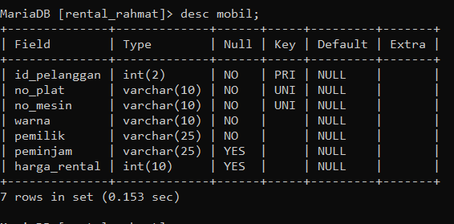
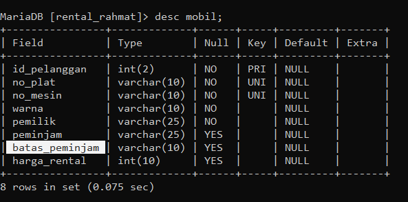
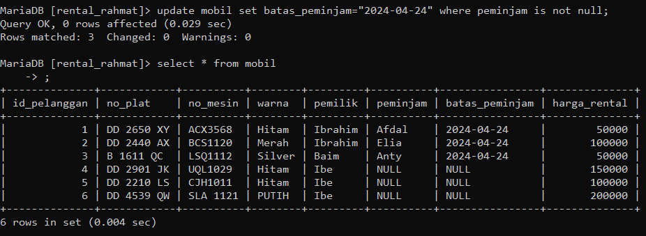
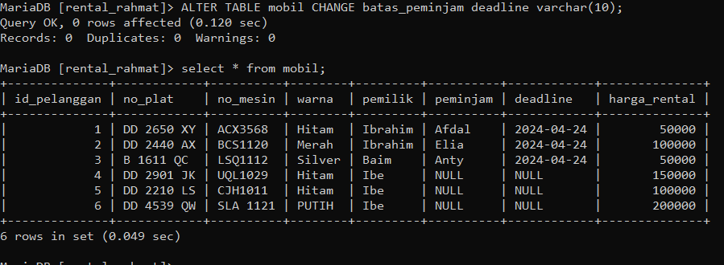
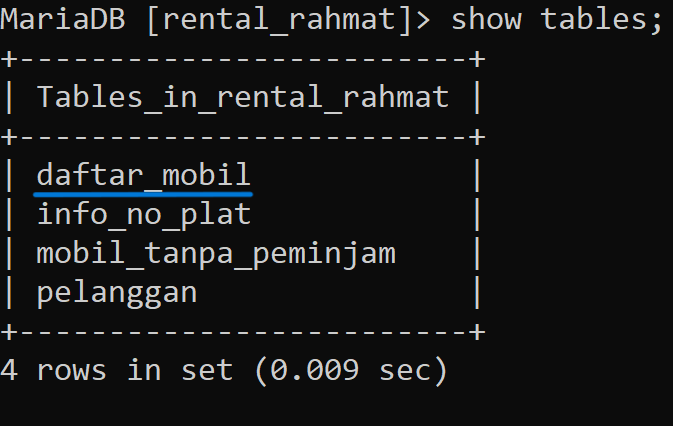
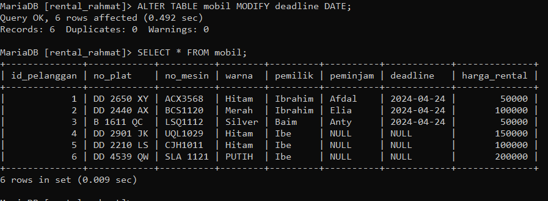
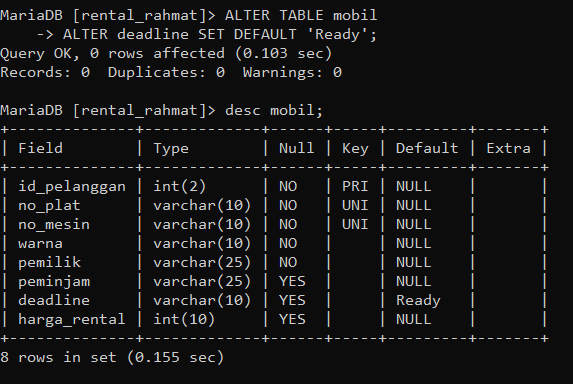
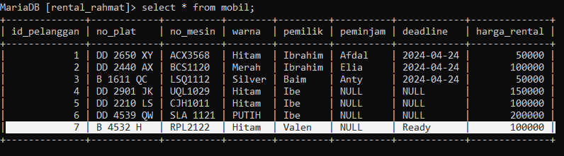
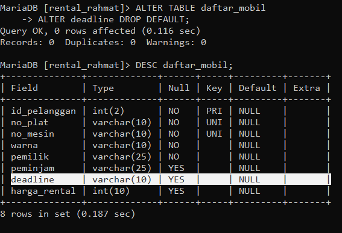

# Menambahkan Colom
## Strutur awal pada tabel mobil:

## Contoh Query
```sql
 ALTER TABLE mobil ADD batas_peminjam varchar(10) AFTER peminjam;
```
`After` Opsional untuk digunakan, jika tidak menggunakan klausa ini maka secara default kolom yang dibuat akan berada di akhir. Jika kolom ingin ditaruh pada awal kolom maka gunakan klausa `First`. dan hasilnya sebagai berikut:
## Hasil

## Analisis
1. `ALTER TABLE mobil`: Ini adalah perintah untuk mengubah struktur tabel "mobil". Perintah ALTER TABLE digunakan untuk menambahkan, mengubah, atau menghapus kolom atau indeks dari sebuah tabel yang sudah ada.
2. `ADD batas_peminjam varchar(10)`: Ini adalah bagian perintah yang menambahkan kolom baru bernama "batas_peminjam" ke tabel "mobil". Kolom ini memiliki tipe data VARCHAR dengan panjang maksimum 10 karakter. VARCHAR adalah tipe data yang digunakan untuk menyimpan teks atau string dengan panjang yang dapat bervariasi.
3. `AFTER peminjam`: Bagian ini menentukan posisi kolom baru di dalam tabel. Dalam hal ini, kolom "batas_peminjam" akan ditempatkan setelah kolom "peminjam". Dengan menentukan urutan kolom, kita dapat mengatur bagaimana struktur tabel akan terbentuk.
## Kesimpulan
Kesimpulan dari analisis program SQL di atas adalah bahwa perintah `ALTER TABLE` digunakan untuk mengubah struktur tabel "mobil" dengan menambahkan kolom baru "batas_peminjam" setelah kolom "peminjam". Kolom baru ini memiliki tipe data VARCHAR dengan panjang maksimum 10 karakter. Dengan menggunakan perintah `AFTER`, kita dapat mengatur posisi kolom baru dalam struktur tabel.
Perubahan struktur tabel ini dapat berguna jika kita ingin memperluas atau mengubah skema penyimpanan data pada tabel yang sudah ada. Namun, penting untuk melihat dampaknya terhadap data yang ada sebelum melakukan perubahan tersebut, serta melakukan backup data sebagai tindakan pencegahan.
Selain itu, analisis tersebut juga menekankan pentingnya modularitas dan keterbacaan dalam pengembangan program SQL. Dengan menggunakan perintah `ALTER TABLE` dan sintaks SQL lainnya, kita dapat mengelola struktur tabel dengan lebih fleksibel dan memudahkan pemeliharaan serta pengembangan aplikasi yang menggunakan basis data.
## Tambahan (+)
## Contoh Query
```sql
update mobil set batas_peminjam="2024-04-24" where peminjam is not null;
```
## Hasil

## Kesimpulan
Pernyataan `UPDATE` digunakan untuk memperbarui nilai kolom dalam tabel. Dalam pernyataan SQL ini, tabel yang diubah adalah "mobil".
Perintah `SET batas_peminjam="2024-04-24"` berarti kita ingin mengubah nilai kolom "batas_peminjam" menjadi tanggal "2024-04-24" untuk baris-baris yang memenuhi kondisi tertentu.
Kondisi tersebut dinyatakan dengan `WHERE peminjam IS NOT NULL`, yang berarti kita hanya ingin mengupdate baris-baris di mana kolom "peminjam" tidak bernilai NULL (tidak kosong). Hal ini bertujuan untuk membatasi pembaruan hanya pada data yang memiliki nilai peminjam yang terisi.
Dengan demikian, kesimpulan dari pernyataan SQL ini adalah bahwa kita ingin mengubah nilai kolom "batas_peminjam" menjadi "2024-04-24" hanya untuk baris-baris di mana kolom "peminjam" tidak kosong.
# Mengubah Nama Colum
Contoh Query
```sql
ALTER TABLE mobil CHANGE batas_peminjam deadline varchar(10);
```
## Hasil

## Analisis
1. `ALTER TABLE mobil`: Ini adalah perintah untuk mengubah struktur tabel "mobil". Perintah ALTER TABLE digunakan untuk menambahkan, mengubah, atau menghapus kolom atau indeks dari sebuah tabel yang sudah ada.
2. `CHANGE batas_peminjam deadline varchar(10)`: Bagian ini mengindikasikan perubahan kolom yang dilakukan. Kolom "batas_peminjam" akan diubah namanya menjadi "deadline", dan tipe datanya akan menjadi VARCHAR dengan panjang maksimum 10 karakter. Dengan menggunakan perintah `CHANGE`, kita dapat mengubah nama kolom dan tipe datanya sekaligus.
## Kesimpulan
Dengan pernyataan SQL di atas, struktur tabel "mobil" akan mengalami perubahan dengan mengganti nama kolom "batas_peminjam" menjadi "deadline" dan mengubah tipe data kolom tersebut menjadi VARCHAR dengan panjang maksimum 10 karakter.
Perubahan ini dapat berguna jika ada kebutuhan untuk mengganti nama kolom yang lebih deskriptif atau mengubah tipe data kolom untuk sesuai dengan kebutuhan aplikasi. Namun, perlu diingat bahwa perubahan struktur tabel dapat mempengaruhi data yang ada di dalamnya, sehingga penting untuk melakukan backup data sebelum melakukan perubahan tersebut.
# Mengganti Nama Tabel
## Contoh Query
```sql
ALTER TABLE mobil RENAME TO daftar_mobil;
```
## Hasil

## Analisis
1. `ALTER TABLE mobil`: Ini adalah perintah untuk mengubah struktur tabel "mobil". Perintah ALTER TABLE digunakan untuk menambahkan, mengubah, atau menghapus kolom atau indeks dari sebuah tabel yang sudah ada.
2. `RENAME TO daftar_mobil`: Bagian ini menunjukkan perubahan nama yang dilakukan pada tabel. Dalam hal ini, tabel "mobil" akan diubah namanya menjadi "daftar_mobil".
## Kesimpulan
Dengan pernyataan SQL di atas, nama tabel "mobil" akan diubah menjadi "daftar_mobil".
Perubahan ini berguna jika kita ingin memberikan nama yang lebih deskriptif atau konsisten untuk tabel yang ada dalam basis data. Dengan mengubah nama tabel, kita dapat meningkatkan pemahaman dan kejelasan dalam struktur basis data.
Namun, perlu diingat bahwa perubahan nama tabel dapat mempengaruhi kode-kode yang menggunakan nama tabel lama. Pastikan untuk memperbarui kode-kode yang terkait dan mempertimbangkan dampaknya terhadap aplikasi yang menggunakan tabel tersebut.
# Mengubah Tipe Data
## Contoh Query
```sql
ALTER TABLE mobil MODIFY deadline DATE;
```

## Hasil

## Analisis
1. `ALTER TABLE mobil`: Ini adalah perintah untuk mengubah struktur tabel "mobil". Perintah ALTER TABLE digunakan untuk menambahkan, mengubah, atau menghapus kolom atau indeks dari sebuah tabel yang sudah ada.
2. `MODIFY deadline DATE`: Bagian ini menunjukkan modifikasi yang dilakukan pada kolom "deadline". Dalam hal ini, tipe data kolom "deadline" akan diubah menjadi DATE. Tipe data DATE digunakan untuk menyimpan tanggal dalam format YYYY-MM-DD.
## Kesimpulan
Dengan pernyataan SQL di atas, struktur tabel "mobil" akan mengalami perubahan dengan mengubah tipe data kolom "deadline" menjadi DATE.
Perubahan ini berguna jika kita ingin memastikan bahwa kolom "deadline" hanya menyimpan nilai tanggal tanpa waktu. Dengan menggunakan tipe data DATE, kita dapat memanfaatkan fungsi dan operasi tanggal yang disediakan oleh sistem basis data.
Namun, perlu diingat bahwa perubahan struktur tabel dapat mempengaruhi data yang ada di dalamnya. Pastikan untuk melakukan backup data sebelum melakukan perubahan struktur tabel yang signifikan dan mempertimbangkan dampaknya terhadap aplikasi yang menggunakan tabel tersebut.
# Menambahkan Constraint
## Contoh Query
```sql
ALTER TABLE mobil
    -> ALTER deadline SET DEFAULT 'Ready';
```
## Hasil

## Analisi
1. `ALTER TABLE mobil`: Ini adalah perintah untuk mengubah struktur tabel "mobil". Perintah ALTER TABLE digunakan untuk menambahkan, mengubah, atau menghapus kolom atau indeks dari sebuah tabel yang sudah ada.
2. `ALTER deadline SET DEFAULT 'Ready'`: Bagian ini menunjukkan modifikasi yang dilakukan pada kolom "deadline". Dalam hal ini, kita menetapkan nilai default 'Ready' untuk kolom "deadline". Artinya, jika tidak ada nilai yang diberikan saat memasukkan data baru ke dalam tabel "mobil" untuk kolom "deadline", maka nilai default 'Ready' akan digunakan.
## Kesimpulan
Dengan pernyataan SQL di atas, struktur tabel "mobil" akan mengalami perubahan dengan menambahkan nilai default 'Ready' ke kolom "deadline".
Perubahan ini berguna jika kita ingin memberikan nilai default kepada kolom "deadline" saat tidak ada nilai yang diberikan secara eksplisit saat memasukkan data baru ke dalam tabel. Dalam hal ini, jika tidak ada tanggal yang diberikan, maka nilai default 'Ready' akan digunakan.
Namun, perlu diingat bahwa perubahan struktur tabel dapat mempengaruhi data yang ada di dalamnya. Pastikan untuk melakukan backup data sebelum melakukan perubahan struktur tabel yang signifikan dan mempertimbangkan dampaknya terhadap aplikasi yang menggunakan tabel tersebut.
## Tambahan (+)
## Contoh Query
```sql
INSERT INTO mobil
    -> (id_pelanggan,no_plat,no_mesin,warna,pemilik,peminjam,harga_rental)
    -> values (7,"B 4532 H","RPL2122","Hitam","Valen",NULL,100000);
```
Hasil

## Kesimpulan
Dengan pernyataan SQL di atas, data baru akan dimasukkan ke dalam tabel "mobil". Data tersebut mencakup nilai-nilai untuk kolom-kolom yang ditentukan, seperti "id_pelanggan", "no_plat", "no_mesin", "warna", "pemilik", "peminjam", dan "harga_rental".
Perintah INSERT INTO digunakan untuk memasukkan data baru ke dalam tabel, dan dengan menyediakan nilai-nilai yang sesuai, baris baru akan ditambahkan ke tabel "mobil" dengan informasi yang diberikan.
Namun, perlu diingat bahwa sebelum menggunakan perintah INSERT INTO, pastikan struktur tabel dan tipe data kolom sesuai dengan data yang akan dimasukkan.
# Menghapus Constraint
## Contoh 
```SQL
ALTER TABLE daftar_mobil
-> ALTER deadline DROP DEFAULT;
```
Hasil

## Analisis
1. `ALTER TABLE daftar_mobil`: Ini adalah perintah untuk mengubah struktur tabel "daftar_mobil". Perintah ALTER TABLE digunakan untuk menambahkan, mengubah, atau menghapus kolom atau indeks dari sebuah tabel yang sudah ada.
2. `ALTER deadline DROP DEFAULT`: Bagian ini menunjukkan modifikasi yang dilakukan pada kolom "deadline". Dalam hal ini, kita menghapus nilai default yang sebelumnya ditetapkan untuk kolom "deadline".
## Kesimpulan
Dengan pernyataan SQL di atas, struktur tabel "daftar_mobil" akan mengalami perubahan dengan menghapus nilai default dari kolom "deadline".
Perubahan ini berguna jika kita ingin menghilangkan nilai default yang sebelumnya ditetapkan untuk kolom "deadline". Setelah perubahan ini, ketika kita memasukkan data baru ke dalam tabel "daftar_mobil" dan tidak memberikan nilai untuk kolom "deadline", kolom tersebut tidak akan memiliki nilai default dan akan bernilai NULL.
Namun, perlu diingat bahwa perubahan struktur tabel dapat mempengaruhi data yang ada di dalamnya. Pastikan untuk melakukan backup data sebelum melakukan perubahan struktur tabel yang signifikan dan mempertimbangkan dampaknya terhadap aplikasi yang menggunakan tabel tersebut.
