 ___
## Definisi Basis Data
- Basis Data adalah __kumpulan inormasi__ yang di simpan di dalam komputer secara sistematik sehingga dapat di periksa menggunakan suatu program komputer untuk memperoleh informasi dari basis data tersebut. Basis Data juga terdiri dari 2 kata yaitu ***Basis*** dan ***Data*** dari dua kata tersebut memiiki definisi tersendiri.
## Basis
- Basis dapat di artikan sebagai __markas__ atau gedung tempat bersarang atau berkumpul
## Data
- Data yaitu kumpulan __fakta dunia nyata__ yang mewakili suatu objek, seperti manusia, barang, dan lain-lain yang direkam ke dalam bentuk angka, bentuk, teks, bunyi, gambar, atau, juga kombinasinya
___
> [! faq] Peranan Basis Data 
> > [! note] Peranan Basis Data di Ponsel
> >>  Peranan basis data terdapat pada ponsel genggam yang sering kita gunakan. Pada ponsel genggam, kita biasanya meyimpan nomor-nomor contact relasi kita. Nomor-nomor yang telah kita simpan secara otomatis dapat terurut sesuai abjad. Apabila kita melakukan panggilan masuk atau panggilan keluar semua akan terekam seperti nomor HP yang telah kita hubungi, kapan kita menghubungi nomor tersebut, siapa nama pemilik nomor tersebut, semua akan muncul
 ___
# Struktur Data Base
	Contoh Gambar 

>Struktur database melibatkan tabel sebagai entitas utama penimpanan data, dalam konteks tabel mahasiswa, setiap table memiliki `field(kolom)` seperti NIM, nama, jk, umur.
>Record adalah `satu baris dalam tabel yang memuat nilai spesifik untuk setiap field.` Misalnya, record dengan NIM 001, nama "Andi", jk "Laki-laki", dan umur 19.
>Dalam konteks penyimpanan fisik, tabel-tabel ini disimpan dalam `tabung` database. Database ini `merupakan wadah` yang dapat berisi satu atau lebih tabel, setiap tabel dalam data base mahasiswa bisa di anggap sebagai file terkait dengan inormasi mahasiswa ini `menciptakan struktur` heararki di mana `database adalah wadah utama`tabel adalah file, dan record adalah entitas individual yang menyimpan informasi mahasiswa

___
# Installing ***XAMPP***
___
- Untuk memulai membuat data base kalian harus mendownload aplikasi `XAMPP`
	1. Pergi ke Chroome dan search `download XAMPP`
	2. Pilih website `apachefriends.org`
	3. Kemudian klik download, kemudian tunggu hasil download
	4. Lalu intall aplikasi `XAMPP`
	5. Tekan `next` hingga menginstall `XAMPP`
	6. dan klik finis
___
# Databases
##  Create Database
- membua data database kita menggunakan query `CREATE_DATABASE [nama_database]` setelah langkah ini *database* akan terbuat, sebagai beriut;
```MYSQL
CREATE DATABASE nama_database;
```
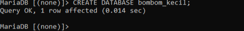
## Show Database
- Untuk menampilkan *data base* kita bisa menggunakan `SHOW_DATABASES;` untuk menampilkan data base yang telah dibuat;
```mysql
SHOW DATABASES;
```
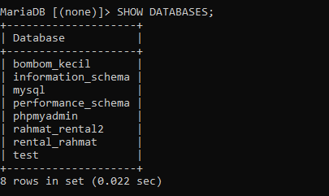
## Use Database
- Untuk menggunakan *database* kita menggunakan query `USE [nama_database]`.
```mysql
USE nama_database;
```
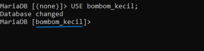
## Delete Database
- Lalu untuk menghapus *data base* kita menggunakan query `DROP DATABASE [nama_database]`dan *database* akan terhapus setelah menuliskan query ini.
```mysql
DROP DATABASE nama_database;
```
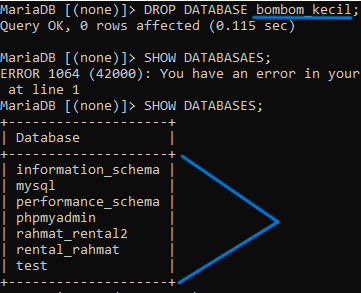
# Tipe Data
## Angka
  - `INT:` Untuk menyimpan nilai bilangan bulat (integer). Misalnya, INT dapat digunakan untuk menyimpan angka seperti 1, 100, -10, dan sebagainya. 
 - `DECIMAL:` Digunakan untuk menyimpan nilai desimal presisi tinggi, cocok untuk perhitungan finansial atau keuangan. 
 - `FLOAT dan DOUBLE:`Digunakan untuk menyimpan nilai desimal dengan presisi floating-point. DOUBLE memiliki presisi lebih tinggi dibandingkan FLOAT.
 - `TINYINT`, `SMALLINT`,`MEDIUMINT`, dan `BIGINT:`Tipe data ini menyimpan bilangan bulat dengan ukuran yang berbeda-beda.
 Contoh : 
```mysql
CREATE TABLE contoh_tabel (
    id INT,
    harga DECIMAL(10, 2),
    jumlah_barang TINYINT
);
```
Dalam contoh tersebut, id menggunakan tipe data INT, harga menggunakan tipe data `DECIMAL `dengan presisi 10 digit dan 2 angka di belakang koma, dan jumlah_barang menggunakan tipe data `TINYINT.`
## Teks
- `CHAR(N)`Menyimpan string karakter tetap dengan panjang N. Contoh: `CHAR(10)` akan menyimpan string dengan panjang tepat 10 karakter.
- `VARCHAR(N):` Menyimpan string karakter dengan panjang variabel maksimal N. Misalnya, `VARCHAR(255)` dapat menyimpan string hingga 255 karakter, tetapi sebenarnya hanya menyimpan panjang yang diperlukan plus beberapa overhead.
- `TEXT:`Digunakan untuk menyimpan teks dengan panjang variabel, tanpa batasan panjang tertentu. Cocok untuk data teks yang panjangnya tidak terduga.
- `ENUM: `Memungkinkan Anda mendefinisikan set nilai yang mungkin dan membatasi kolom hanya dapat mengambil salah satu dari nilai tersebut.
- `SET:` Mirip dengan ENUM, namun dapat menyimpan satu atau lebih nilai dari himpunan yang telah ditentukan.
Contoh :
```mysql
CREATE TABLE contoh_tabel (
    nama CHAR(50),
    alamat VARCHAR(100),
    catatan TEXT,
    status ENUM('Aktif', 'Non-Aktif')
);
```
## Tanggal
- `DATE` :  Menyimpan nilai tanggal dengan format YYYY-MM-DD.
- `TIME`: Menyimpan nilai waktu dengan format HH:MM:SS.
- `DATETIME`: Menggabungkan nilai tanggal dan waktu dengan format YYYY-MM-DD HH:MM:SS.
- `TIMESTAMP`:Sama seperti DATETIME, tetapi dengan kelebihan diatur secara otomatis saat data dimasukkan atau diubah.
Contoh :
```mysql
CREATE TABLE ContohTabel (
    tanggal DATE,
    waktu TIME,
    datetimekolom DATETIME,
    timestampkolom TIMESTAMP
);
```
Dalam contoh ini, kolom `tanggal` akan menyimpan nilai tanggal,`waktu` menyimpan nilai waktu, `datetimekolom` menyimpan kombinasi tanggal dan waktu, dan `imestampkolom` akan secara otomatis diatur saat data dimasukkan atau diubah.
## Boolean
- `BOOL / BOOLEAN / TINYINT(1):` Digunakan untuk menyimpan nilai boolean, yang dapat mewakili kebenaran atau kesalahan. Representasi nilai benar adalah `1`, sedangkan nilai salah direpresentasikan sebagai 0. Meskipun nilai selain 0 dianggap benar, secara umum, ketiganya seringkali digunakan secara bergantian. Seringkali, ketika Anda mendeklarasikan kolom sebagai BOOL atau BOOLEAN, MySQL mengonversinya secara otomatis menjadi TINYINT(1), yang juga dapat digunakan untuk menyimpan nilai boolean dengan 0 untuk false dan 1 untuk true.
Contoh :
1. Menggunakan `BOOLEAN`
```mysql
CREATE TABLE contohTabel (
    title VARCHAR(255),
    completed BOOLEAN
);
```
Dalam contoh diatas, kita mendefinisikan kolom completed sebagai tipe data BOOLEAN. Ini merupakan cara yang sah dan umum digunakan di MySQL. Nilai yang dapat disimpan dalam kolom ini adalah TRUE atau FALSE, atau dalam representasi angka, 1 atau 0.
2. Menggunakan `BOOL`
```mysql
CREATE TABLE contohTabel (
    title VARCHAR(255),
    completed BOOL
);
```
Dalam contoh ini, kita menggunakan `BOOL` sebagai tipe data untuk kolom completed. Perlu dicatat bahwa MySQL secara otomatis mengonversi `BOOL` menjadi `TINYINT(1)`. Oleh karena itu, pada dasarnya, ini setara dengan contoh pertama. Namun, beberapa pengembang lebih suka menggunakan BOOLEAN untuk kejelasan.
3. Menggunakan `TINYINT(1)`
```mysql
CREATE TABLE contohTabel (
    title VARCHAR(255),
    completed TINYINT(1)
);
```
Dalam contoh ini, kita menggunakan `TINYINT(1)` sebagai tipe data untuk kolom completed. Ini adalah pendekatan yang valid karena MySQL mengonversi BOOL menjadi TINYINT(1) secara otomatis. Dalam hal ini, nilai yang dapat disimpan adalah `1` untuk `TRUE` dan `0` untuk `FALSE`.
# Tabel
## Created Table
- Jika kalian ingin membuat tabel Ketikkan
	```mysql
	CREATE TABLE [nama_table] (
     nama_kolom1 tipe_data(ukuran) [tipe_constraint]
     nama_kolom2 tipe_data(ukuran) [tipe_constraint]
     nama_kolom3 tipe_data(ukuran) [tipe_constraint]
    );
	```
	kemudian enter. Nanti akan muncul seperti di bawah.
	
## Struktur Table
- Lalu setelah membuat tabel kita dapat menampilkan struktur dari tabel yang kita buat dengan cara mengetik `DESC (nama_tabel` dan hasilnya akan seperti di bawah 
```mysql
DESC nama_tabel;
```
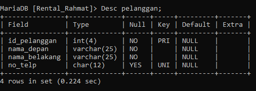
## Show Tables
- Untuk menampilkan daftar tabel yang ada dalam _database_ kita menggunakan query `SHOW TABLES;`dan hasil yang akan tampil ialah seperti berikut
```mysql
SHOW TABLES;
```
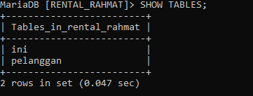
# Q&A
## Pertanyaan
1) Mengapa hanya kolom `id_pelanggan` yang menggunakan constraint `PRIMARY KEY`?
2) Mengapa pada kolom `no_telp` yang menggunakan data `CHAR` bukan `VARCHAR`?
3) Mengapa hanya kolom `no_telp` yang menggunakan constraint `UNIQUE`?
4) Mengapa kolom `no_telp` tidak memakai constraint `NOT NULL` sementara kolom lainnya menggunakan constraint tersebut?
5) Tuliskan perbedaan antara `PRIMARY KEY` dengan `UNIQUE`?
___
## Jawaban:  
1. Untuk membedakan `id Pelanggan`  yang sama, mencegah duplikasi, dan mempermudah pencarian data.
2. Tipe data `char` menyimpan data dalam karakter panjang lebih efisien. pencarian pada kolom tipe data `CHAR` dapat lebih cepat
3. Karna `no_telp` tidak ada yang sama semua pasti berbeda dan nilainya unik maka menggunakan constrains unique artinya data dalam tabel `id_telpon` berbeda tidak ada yang sama. 
4. Nomor telpon dianggap opsional. nomor telepon hanya menjadi wajib saat pengguna melakukan langkah-langkah tertentu, Anda mungkin tidak ingin mengharuskan pengguna mengisinya pada tahap awal.
5. `PRIMERY KEY` untuk membedakan data yang sama dan hanya boleh 1 dan tidak boleh tidak ada. Kalau `UNiQUE` sebuah kolom yang memiliki data yang berbeda atau tidak sama unique boleh 1,2,3 Dan seterusnya dan boleh tidak ada.
___
# Insert, Select, Update, & Delete
- Setelah mempelajari cara untuk membuat, melihat struktur dan menampilkan daftar table sekarang kita akan mempelajari cara memasukan data pada table serta menampilkan hasil dari table tersebut, untuk melakukannya kita akan membaginya menjadi dua bagian yaitu Insert dan Select.
## Insert
- Query satu ini memiliki fungsi untuk memasukkan sebuah nilai pada tabel yang telah kita buat dan kita akan mempelajari insert data 1 baris dan lebih satu baris
### Insert 1 baris
- Untuk menginput data satu baris, kita menggunakan format seperti berikut;
	```mysql
	INSERT INTO nama_tabel
    -> VALUES (data_1, data_2, data_3, data_4);
    ```
- **Result**
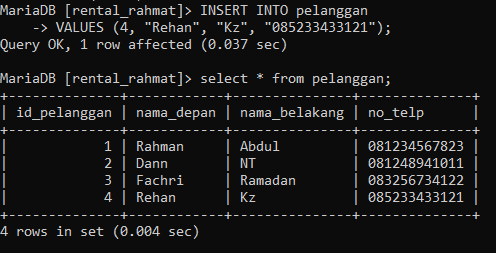
### Insert lebih dari 1 baris
- Sedangkan untuk menginput nilai yang lebih dari satu baris kita menggunakan format sebagai berikut;
```mysql
INSERT INTO [NAMA_TABLE]
-> VALUES (DATA_1, DATA_2, DATA_3, DATA_4),
-> (DATA_1, DATA_2, DATA_3, DATA_4),
-> (DATA_1, DATA_2, DATA_3, DATA_4);
```
- Result
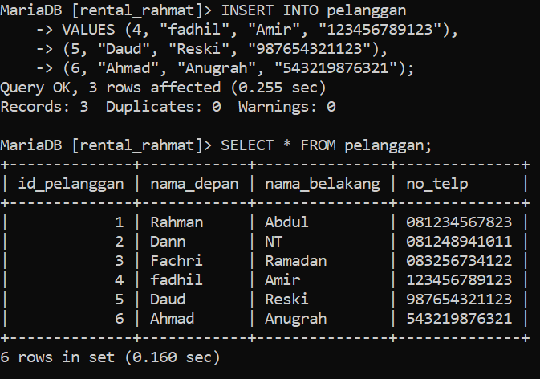
## Select
- Selanjutnya query ini memiliki fungsi untuk menampilkan hasil dari tabel yang telah di inputkan (insert) data kedalam tabel tersebut, berbeda dengan `desc` yang hanya menampilkan struktur dari tabel query ini menampilkan hasil dari tabel
### Select (Semua Tabel)
- Untuk menampilkan hasil dari seluruh tabel yang telah di buat atau menampilkan seluruh baris dan kolom kita menggunakan format sebagai berikut;y
```MySQL
SELECT * FROM (NAMA_TABEL)
```
- Result
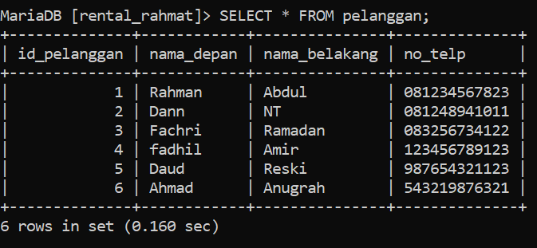
### Select (hanya kolom)
- lalu untuk menampilkan beberapa kolom yang spesifik kita dapat menggunakan format yang sedikit berbeda dengan format all table, yaitu seperti dibawah ini :
```mysql
SELECT NAMA_KOLOM_1, NAMA_KOLOM_2, NAMA_KOLOM_N FROM PELANGGAN;
```
- Result
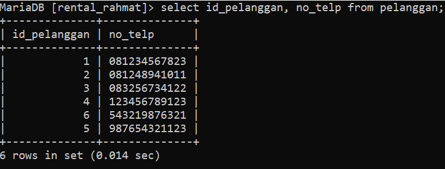
### Select kondisi "where"
- lalu kondisi yang saat satu ini berfungsi untuk mengambil data yang lebih spesifik dari sebuah field dengan simbol simbol aritmatika mulai dari "+", "-", "/", "%",">","<". Misalnya kita meminta untuk menampilkan field "Nama_Depan" pada "Id_Pelanggan" ke 2, kita dapat menggunakan simbol aritmatika seperti berikut :
```mysql
SELECT Nama_Kolom FROM Nama_Table WHERE Id_Pelanggan=2;
```
- Result
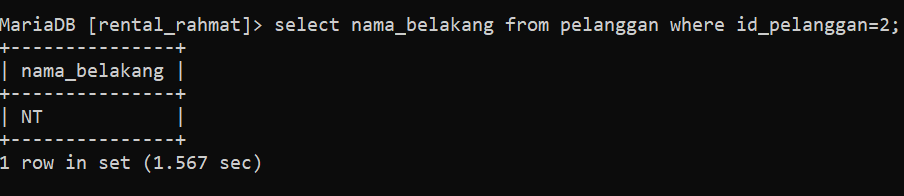
> [!tip] Analisis
>> - Insert ialah query yang berfungsi untuk memasukkan data pada table yang telah kita buat.
>> - Select ialah query yang berfungsi untuk menampilkan hasil table dan select ini terbagi menjadi 3 bagian.
>> - 3 Jenis Select ialah Select All Table, Select Field Spesifik dan Select kondisi atau "Where". 
>> - Where ini berisikan simbol simbol aritamtika mulai dari "+", "-", "/", "%",">","<".
>> - "*" simbol bintang ini memiliki makna "all" atau "semua" 
### Kesimpulan
- Kesimpulannya ialah *insert* bertugas untuk memasukkan nilai pada table yang telah dibuat dan *Select* berfungsi untuk menampilkan hasil dari table yang telah dibuat dan di input datanya dari Query sebelumnya, lalu *Select* ini dapat menampilkan semua sesuai dengan yang kita menggunakan misalnya jika ingin menampilkan seluruh table kita menggunakan simbol "*" atau All lalu jika ingin menampilkan beberapa field kita dapat menggunakan format hanya perlu memanggil nama fieldnya.
- Lalu yang terakhir ialah kondisi "Where" dimana kita dapat memanggil nama field dengan menggunakan simbol aritmatika, misalnya kita ingin memanggil field "Nama_Pelanggan" tapi hanya ''Id_Pelanggan" 2 kita dapat menggunkan format seperti ini SELECT Nama_Kolom FROM Nama_Table WHERE Id_Pelanggan=2;
## Update
- Selanjutnya jika ingin mengganti nilai dari sebuah kolom tertentu  kita bisa menggunakan Query *Update* lalu formatnya seperti dibawah ini :
```mysql
Format :
UPDATE [Nama_Table] SET [Nama_Kolom]="Nilai_Pengganti" WHERE kondisi;
```
- Result
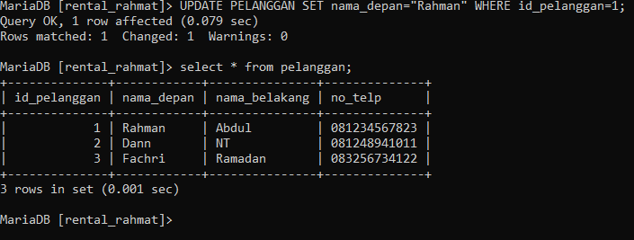
## Delete
- Kita juga dapat menghapus baris pada table dengan Query *Delete*, untuk menghapus keseluruhan baris kita dapat menggunakan format seperti ini :
```mysql
Format :
DELETE FROM [Nama_Table] WHERE [Nama_Kolom];
```
- Result
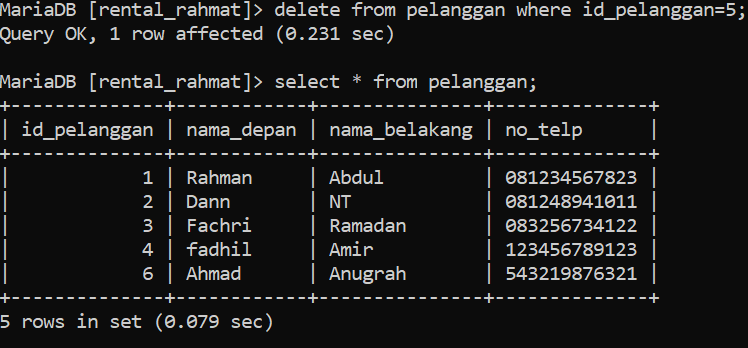
> [!tip] Analisis
>> *Update* ialah Query untuk mengganti nilai yang telah ada pada sebuah table yang telah ada sebelumnya.
>> *Delete* ialah Query untuk menghapus baris pada sebuah tabel yang telah dibuat sebelumnya.
>> Penggunaan Where masih sangat berperan penting dalam kondisi seperti ini.
### Kesimpulan 
dua Query yang akan dipelajari selanjutnya ialah untuk mengganti data dan menghapus baris data pada table. Query nya ialah *Update* untuk mengganti data yang telah ada pada table, dan Query *Delete* untuk menghapus nilai yang telah ada pada table yang telah kita buat. kedua Query ini memiliki format yang lumayan mirip, dimana memerlukan Where untuk menuliskan kondisinya.

