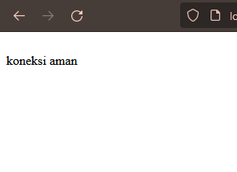
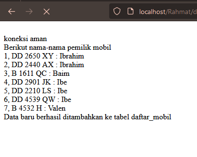
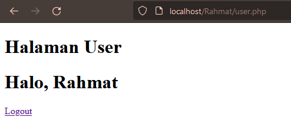
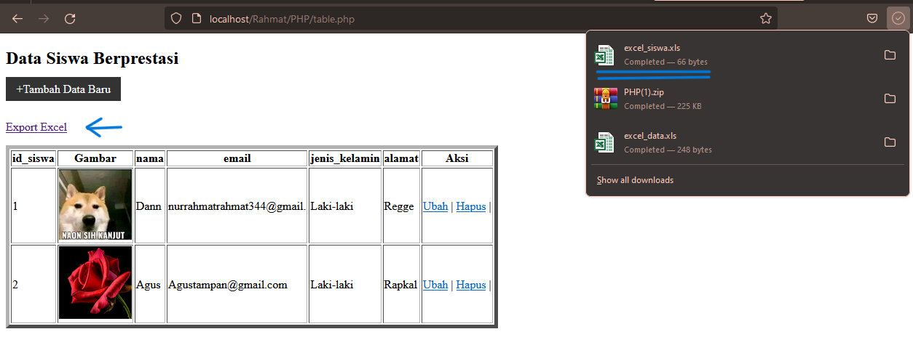

# Koneksi DataBase
**Kode Program:**
```php
<php

//koneksi ke database
$koneksi = mysqli_connect('localhost', 'root', '', 'rental_rahmat');
  
if ($koneksi) {
    echo "<br> koneksi aman <br>";
} else {
     echo "error, tidak bisa koneksi ke database";
}

  
//jalankan query seleksi
//$select = mysqli_query($koneksi, "SELECT * FROM daftar_mobil");
  
// //membuat array dan memecah data berdasarkan kolomnya
// $result = mysqli_fetch_assoc($select);

// //menampilkan struktur array dari data tabel yang dijalankan di atas
// // var_dump($result);


// echo 'Berikut nama-nama pemilik mobil<br>';

// $a = 1; 
// foreach($select as $key => $data){

//     echo $a++ . ", " . $data ['no_plat'] . " : " . $data ['pemilik'] . '<br>';

// }


// // echo '<p>Halo ' . $result['pemilik'] . '!!</p><br>';
```
**Hasil:**

**Analisis:**
1. Koneksi ke database:
	- Menggunakan fungsi `mysqli_connect()` untuk membuat koneksi ke database MySQL dengan parameter host ('localhost'), username ('root'), password (''), dan nama database ('rental_rahmat').
	- Jika koneksi berhasil, maka pesan "koneksi aman" akan ditampilkan. Jika tidak, pesan "error, tidak bisa koneksi ke database" akan ditampilkan.

**Kesimpulan:**

Program PHP dan SQL di atas bertujuan untuk melakukan koneksi ke database MySQL menggunakan fungsi `mysqli_connect()`. Setelah koneksi berhasil, pesan "koneksi aman" akan ditampilkan. Jika terdapat masalah dalam koneksi, maka pesan "error, tidak bisa koneksi ke database" akan ditampilkan.
Namun, pada kode yang diberikan, tag pembuka PHP ditulis sebagai "<php" yang seharusnya "<php" (dengan tanda "?"). Pastikan untuk mengubahnya menjadi "<php" agar kode PHP dapat dieksekusi dengan benar.
# Tampilkan Data
**Kode Program:**
```php
<?php

//koneksi ke database
$koneksi = mysqli_connect('localhost', 'root', '', 'rental_rahmat');
  
if ($koneksi) {
    echo "<br> koneksi aman <br>";
} else {
    echo "error, tidak bisa koneksi ke database";
}
  
//jalankan query seleksi
$select = mysqli_query($koneksi, "SELECT * FROM daftar_mobil");

// //membuat array dan memecah data berdasarkan kolomnya
// $result = mysqli_fetch_assoc($select);
  
//menampilkan struktur array dari data tabel yang dijalankan di atas
// var_dump($result);
  
echo 'Berikut nama-nama pemilik mobil<br>';

$a = 1;
foreach($select as $key => $data){
    echo $a++ . ", " . $data ['no_plat'] . " : " . $data ['pemilik'] . '<br>';
}
  
// echo '<p>Halo ' . $result['pemilik'] . '!!</p><br>';
```
**Hasil:**


**Analisis:**
1. Koneksi ke database:
    - Menggunakan fungsi `mysqli_connect()` untuk membuat koneksi ke database MySQL dengan parameter host ('localhost'), username ('root'), password (''), dan nama database ('rental_rahmat').
    - Jika koneksi berhasil, maka pesan "koneksi aman" akan ditampilkan. Jika tidak, pesan "error, tidak bisa koneksi ke database" akan ditampilkan.
2. Jalankan query seleksi:
    - Menggunakan fungsi `mysqli_query()` untuk menjalankan query SQL yang melakukan seleksi data dari tabel "daftar_mobil" dalam database.
    - Hasil query disimpan dalam variabel `$select`.
3. Menampilkan data:
    - Menampilkan pesan "Berikut nama-nama pemilik mobil" sebagai judul.
    - Menggunakan perulangan `foreach` untuk mengiterasi setiap baris data yang ditemukan dalam `$select`.
    - Setiap baris data ditampilkan dengan format nomor plat mobil dan nama pemiliknya.

**Kesimpulan:**

Program PHP dan SQL di atas berfungsi untuk melakukan koneksi ke database, menjalankan query seleksi, dan menampilkan data dari tabel "daftar_mobil". Program ini akan menampilkan nama-nama pemilik mobil yang ada dalam tabel tersebut dengan format nomor plat dan nama pemilik.
Namun, perlu diperhatikan bahwa bagian yang mengakses data menggunakan `$select` dalam perulangan `foreach` tidak tepat. Seharusnya, variabel `$select` diganti dengan `mysqli_fetch_assoc($select)` untuk mengambil setiap baris data secara berurutan. Dalam kode yang diberikan, perulangan `foreach` tidak akan berfungsi dengan benar. Jika ingin menampilkan semua baris data, perlu dilakukan perubahan pada kode tersebut.
# Tambahkan Data
**Kode Program:**
```php
<?php
  
//koneksi ke database
$koneksi = mysqli_connect('localhost', 'root', '', 'rental_rahmat');

if ($koneksi) {
    echo "<br> koneksi aman <br>";
} else {
    echo "error, tidak bisa koneksi ke database";
}


//jalankan query seleksi
$select = mysqli_query($koneksi, "SELECT * FROM daftar_mobil");
  

//menampilkan struktur array dari data tabel yang dijalankan di atas
// var_dump($result);
  

echo 'Berikut nama-nama pemilik mobil<br>';
  
$a = 1;
foreach($select as $key => $data){
    echo $a++ . ", " . $data['no_plat'] . " : " . $data['pemilik'] . '<br>';
}
  
//Tambahkan data baru ke tabel daftar_mobil
$no_plat_baru = "AB 1234 CD";
$pemilik_baru = "John Doe";
  
$insert = mysqli_query($koneksi, "INSERT INTO daftar_mobil (no_plat, pemilik) VALUES ('$no_plat_baru', '$pemilik_baru')");
  
if ($insert) {
    echo "Data baru berhasil ditambahkan ke tabel daftar_mobil";
} else {
    echo "Gagal menambahkan data baru ke tabel daftar_mobil";
}

// echo '<p>Halo ' . $result['pemilik'] . '!!</p><br>';

?>
```
**Hasil:**



**Analisis:**
1. Koneksi ke database:
    - Menggunakan fungsi `mysqli_connect()` untuk membuat koneksi ke database MySQL dengan parameter host ('localhost'), username ('root'), password (''), dan nama database ('rental_rahmat').
    - Jika koneksi berhasil, maka pesan "koneksi aman" akan ditampilkan. Jika tidak, pesan "error, tidak bisa koneksi ke database" akan ditampilkan.
2. Jalankan query seleksi:
    - Menggunakan fungsi `mysqli_query()` untuk menjalankan query SQL yang melakukan seleksi data dari tabel "daftar_mobil" dalam database.
    - Hasil query disimpan dalam variabel `$select`.
3. Menampilkan data:
    - Menampilkan pesan "Berikut nama-nama pemilik mobil" sebagai judul.
    - Menggunakan perulangan `foreach` untuk mengiterasi setiap baris data yang ditemukan dalam `$select`.
    - Setiap baris data ditampilkan dengan format nomor plat mobil dan nama pemiliknya.
4. Menambahkan data baru:
    - Menambahkan data baru ke tabel "daftar_mobil" dengan menggunakan fungsi `mysqli_query()` untuk menjalankan query SQL INSERT.
    - Data baru yang ditambahkan adalah nomor plat baru dan pemilik baru yang disimpan dalam variabel `$no_plat_baru` dan `$pemilik_baru`.

**Kesimpulan:**

Program PHP dan SQL di atas berfungsi untuk melakukan koneksi ke database, menjalankan query seleksi, menampilkan data dari tabel "daftar_mobil", dan menambahkan data baru ke tabel tersebut. Program ini akan menampilkan nama-nama pemilik mobil yang ada dalam tabel, kemudian menambahkan data baru dengan nomor plat dan pemilik yang ditentukan.
Harap diingat bahwa sebelum menjalankan program ini, pastikan koneksi ke database telah berhasil dan struktur tabel "daftar_mobil" telah sesuai. Juga, perhatikan bahwa program ini menggunakan data yang telah ditentukan sebelumnya untuk penambahan data baru. Anda dapat mengubah nilai variabel `$no_plat_baru` dan `$pemilik_baru` sesuai dengan data yang ingin ditambahkan.
# Ubah Data
**Kode Program:**
```php
<?php
  
//koneksi ke database
$koneksi = mysqli_connect('localhost', 'root', '', 'rental_rahmat');

if ($koneksi) {
    echo "<br> koneksi aman <br>";
} else {
    echo "error, tidak bisa koneksi ke database";
}

//jalankan query seleksi
$select = mysqli_query($koneksi, "SELECT * FROM daftar_mobil");
  
echo 'Berikut nama-nama pemilik mobil sebelum perubahan<br>';
  
$a = 1;
foreach($select as $key => $data){
    echo $a++ . ", " . $data['no_plat'] . " : " . $data['pemilik'] . '<br>';
}

//Ubah data dalam tabel daftar_mobil
$no_plat_lama = "AB 1234 CD";
$pemilik_baru = "Amir";

$update = mysqli_query($koneksi, "UPDATE daftar_mobil SET pemilik='$pemilik_baru' WHERE no_plat='$no_plat_lama'");

if ($update) {
    echo "Data berhasil diubah";
} else {
    echo "Gagal mengubah data";
}

//jalankan query seleksi setelah perubahan
$select_after_update = mysqli_query($koneksi, "SELECT * FROM daftar_mobil");

echo 'Berikut nama-nama pemilik mobil setelah perubahan<br>';

$a = 1;
foreach($select_after_update as $key => $data){
    echo $a++ . ", " . $data['no_plat'] . " : " . $data['pemilik'] . '<br>';
}

?>
```
**Hasil:**


**Analisis:**

1. Koneksi ke database:
    - Menggunakan fungsi `mysqli_connect()` untuk membuat koneksi ke database MySQL dengan parameter host ('localhost'), username ('root'), password (''), dan nama database ('rental_rahmat').
    - Jika koneksi berhasil, maka pesan "koneksi aman" akan ditampilkan. Jika tidak, pesan "error, tidak bisa koneksi ke database" akan ditampilkan.
2. Jalankan query seleksi:
    - Menggunakan fungsi `mysqli_query()` untuk menjalankan query SQL yang melakukan seleksi data dari tabel "daftar_mobil" dalam database.
    - Hasil query disimpan dalam variabel `$select`.
3. Menampilkan data sebelum perubahan:
    - Menampilkan pesan "Berikut nama-nama pemilik mobil sebelum perubahan" sebagai judul.
    - Menggunakan perulangan `foreach` untuk mengiterasi setiap baris data yang ditemukan dalam `$select`.
    - Setiap baris data ditampilkan dengan format nomor plat mobil dan nama pemiliknya.
4. Ubah data dalam tabel daftar_mobil:
    - Menggunakan query SQL UPDATE untuk mengubah data dalam tabel daftar_mobil.
    - Data yang akan diubah adalah pemilik mobil dengan nomor plat lama yang disimpan dalam variabel `$no_plat_lama`, dengan pemilik baru yang ditetapkan dalam variabel `$pemilik_baru.
5. Menampilkan data setelah perubahan:
    - Menampilkan pesan "Berikut nama-nama pemilik mobil setelah perubahan" sebagai judul.
    - Menjalankan query seleksi lagi setelah perubahan.
    - Menggunakan perulangan `foreach` untuk mengiterasi setiap baris data yang ditemukan dalam `$select_after_update`.
    - Setiap baris data ditampilkan dengan format nomor plat mobil dan nama pemiliknya.

**Kesimpulan:**

Program PHP dan SQL di atas berfungsi untuk melakukan koneksi ke database, menjalankan query seleksi, menampilkan data sebelum perubahan, mengubah data dalam tabel "daftar_mobil", dan menampilkan data setelah perubahan. Program ini akan menampilkan nama-nama pemilik mobil sebelum dan setelah perubahan yang dilakukan. 
Pastikan koneksi ke database telah berhasil dan struktur tabel "daftar_mobil" sesuai sebelum menjalankan program ini. Perhatikan bahwa program ini mengubah data pemilik mobil dengan nomor plat lama tertentu menjadi pemilik baru yang ditetapkan. Anda dapat mengubah nilai variabel `$no_plat_lama` dan `$pemilik_baru` sesuai dengan data yang ingin diubah.
# Hapus Data
**Kode Program:**
```php file:database.php
<?php

// Koneksi ke database
$koneksi = mysqli_connect('localhost', 'root', '', 'rental_rahmat');

  
if ($koneksi) {
    echo "<br> Koneksi aman <br>";
} else {
    echo "Error, tidak bisa koneksi ke database";
}
  
// Jalankan query seleksi
$select = mysqli_query($koneksi, "SELECT * FROM daftar_mobil");
echo 'Berikut nama-nama pemilik mobil sebelum penghapusan<br>';

$a = 1;
foreach ($select as $key => $data) {
    echo $a++ . ", " . $data['no_plat'] . " : " . $data['pemilik'] . '<br>';
}


// Hapus data dalam tabel daftar_mobil
$no_plat_hapus = "AB 1234 CD";

$delete = mysqli_query($koneksi, "DELETE FROM daftar_mobil WHERE no_plat='$no_plat_hapus'");
  
if ($delete) {
    echo "Data berhasil dihapus<br>";
} else {
    echo "Gagal menghapus data";
}

  
// Jalankan query seleksi setelah penghapusan
$select_after_delete = mysqli_query($koneksi, "SELECT * FROM daftar_mobil");
  
echo 'Berikut nama-nama pemilik mobil setelah penghapusan<br>';
  
$a = 1;
foreach ($select_after_delete as $key => $data) {
    echo $a++ . ", " . $data['no_plat'] . " : " . $data['pemilik'] . '<br>';
}
  
?>
```
**Hasil:**


**Analisis:**

1. Koneksi ke database:
    - Menggunakan fungsi `mysqli_connect()` untuk membuat koneksi ke database MySQL dengan parameter host ('localhost'), username ('root'), password (''), dan nama database ('rental_rahmat').
    - Jika koneksi berhasil, maka pesan "koneksi aman" akan ditampilkan. Jika tidak, pesan "Error, tidak bisa koneksi ke database" akan ditampilkan.
2. Jalankan query seleksi:
    - Menggunakan fungsi `mysqli_query()` untuk menjalankan query SQL yang melakukan seleksi data dari tabel "daftar_mobil" dalam database.
    - Hasil query disimpan dalam variabel `$select`.
3. Menampilkan data sebelum penghapusan:
    - Menampilkan pesan "Berikut nama-nama pemilik mobil sebelum penghapusan" sebagai judul.
    - Menggunakan perulangan `foreach` untuk mengiterasi setiap baris data yang ditemukan dalam `$select`.
    - Setiap baris data ditampilkan dengan format nomor plat mobil dan nama pemiliknya.
4. Hapus data dalam tabel daftar_mobil:
    - Menggunakan query SQL DELETE untuk menghapus data dari tabel daftar_mobil.
    - Data yang akan dihapus adalah baris dengan nomor plat yang sesuai dengan nilai variabel `$no_plat_hapus`.
5. Menampilkan data setelah penghapusan:
    - Menampilkan pesan "Berikut nama-nama pemilik mobil setelah penghapusan" sebagai judul.
    - Menjalankan query seleksi lagi setelah penghapusan data.
    - Menggunakan perulangan `foreach` untuk mengiterasi setiap baris data yang ditemukan dalam `$select_after_delete`.
    - Setiap baris data ditampilkan dengan format nomor plat mobil dan nama pemiliknya.

**Kesimpulan:**

Program PHP dan SQL di atas berfungsi untuk melakukan koneksi ke database, menjalankan query seleksi, menampilkan data sebelum penghapusan, menghapus data dalam tabel "daftar_mobil", dan menampilkan data setelah penghapusan. Program ini akan menampilkan nama-nama pemilik mobil sebelum dan setelah penghapusan yang dilakukan.
Pastikan koneksi ke database telah berhasil dan struktur tabel "daftar_mobil" sesuai sebelum menjalankan program ini. Perhatikan bahwa program ini menghapus data dengan nomor plat tertentu yang ditentukan oleh nilai variabel `$no_plat_hapus`. Anda dapat mengubah nilai variabel tersebut sesuai dengan nomor plat yang ingin dihapus.
# Session/Login
**Kode Program:**
```php file:session.php
<?php

session_start();
  
//$username = "Jordan";
//$alamat = "Pampang";
  
//$_SESSION['$username'] = $username;
//$_SESSION['alamat'] = $alamat;
  
if (isset ($_POST['submit'])){
    $username = $_POST['username'];
    $password = $_POST['password'];
    $koneksi = mysqli_connect('localhost', 'root', '', 'latihan_rpl_1') or die('error koneksi');
    $result = mysqli_query($koneksi, "SELECT * FROM user
                            WHERE username = '$username' AND password = '$password'");
  
    $data = mysqli_fetch_assoc($result);
    var_dump($data);
    
    if (isset($data)){
        $_SESSION['username'] = $data['username'];
        $_SESSION['nama'] = $data['nama'];
        $_SESSION['status'] = 'login';
        header('Location: user.php');
    } else {
        echo "Username dan Password Salah";
    }

    }
  
?>
  
<!DOCTYPE html>
<html lang="en">
<head>
    <title>SessionLogin</title>
</head>
<body>
    <form method="post">
        <label for="">username</label>
        <input type="text" name="username">
        <br>
        <label for="">password</label>
        <input type="password" name="password">
        <br>
        <button type="submit" name="submit">Login</button>
    </form>
</body>
</html>
```
```php file:user.php
<?php

session_start();
  
if ($_SESSION['status'] == 'login' && $_SESSION['username'] == 'admin') {
    header("Location: admin.php");
}
if ($_SESSION['status'] != 'login') {
    header('Location: session.php');
}
  
?>
<!DOCTYPE html>
<html lang="en">
  
<head>
    <title>Document</title>
</head>
<body>
    <h1>Halaman User</h1>
    <h1>Halo, <?= $_SESSION['nama'] ?></h1>
    <a href="logout.php">Logout</a>
</body>
</html>
```
```php file:cek_user.php
<?php
  
if ($_SESSION['status'] == 'login' && $_SESSION['username'] != 'admin') {
    header("Location: user.php");
    exit();
} else if ($_SESSION['status'] == 'login' && $_SESSION['username'] == 'admin') {
    header("Location: admin.php");
}else{
    header("Location: session.php");
}
```
```php file:admin.php
<?php

session_start();
  
if ($_SESSION['status'] == 'login' && $_SESSION['username'] != 'admin') {
    header("Location: user.php");
}
  
if ($_SESSION['status'] != 'login') {
    header('Location: session.php');
}
  
?>
<!DOCTYPE html>
<html lang="en">
<head>
    <title>Document</title>
</head>
<body>
    <h1>Halaman Admin</h1>
    <h1>Halo, <?= $_SESSION['nama'] ?></h1>
    <a href="logout.php">Logout</a>
</body>
</html>
```
**Hasil:**

 



**Analisis:**

1. Pada bagian PHP:
    - Program memulai session dengan menggunakan fungsi `session_start()`. Hal ini penting untuk memulai dan mengelola session di PHP.
    - Jika terdapat data yang dikirimkan melalui metode POST dengan nama "submit" (diperiksa menggunakan `isset($_POST['submit'])`), maka program akan melakukan proses login.
    - Data username dan password yang dikirimkan melalui form diambil menggunakan `$_POST['username']` dan `$_POST['password']`.
    - Dilakukan koneksi ke database MySQL menggunakan `mysqli_connect()` dengan parameter host, username, password, dan nama database.
    - Dilakukan query SQL untuk mencocokkan data username dan password yang diberikan dengan data di tabel "user" menggunakan perintah `mysqli_query()`.
    - Hasil query diambil menggunakan `mysqli_fetch_assoc()` dan disimpan dalam variabel `$data`.
    - Hasil dari `$data` ditampilkan menggunakan `var_dump()` untuk tujuan debugging.
    - Jika `$data` memiliki nilai (artinya username dan password cocok), maka session akan diset dengan variabel-variabel dari data tersebut, dan pengguna akan diarahkan ke halaman "user.php" menggunakan `header('Location: user.php')`.
    - Jika tidak ada data yang cocok, maka akan ditampilkan pesan "Username dan Password Salah".
2. Pada bagian HTML:
    - Terdapat sebuah form dengan metode POST.
    - Form tersebut memiliki input field untuk username dan password.
    - Terdapat tombol "Login" yang akan mengirimkan data form saat ditekan.

**Kesimpulan:**

File `session.php` adalah program PHP yang melakukan proses login menggunakan session. Program ini memeriksa apakah data username dan password yang diberikan cocok dengan data yang ada di database. Jika cocok, session akan diset dengan variabel-variabel dari data tersebut dan pengguna akan diarahkan ke halaman "user.php". Jika tidak cocok, pesan kesalahan akan ditampilkan. Namun, perlu diperhatikan bahwa file ini belum mengimplementasikan fitur keamanan seperti sanitasi input dan penggunaan prepared statement untuk mencegah serangan SQL Injection.
# Upload & Download
## Upload
**Kode Program:**
```php file:upload.php
<!DOCTYPE html>
<html lang="en">
  
<head>
    <title>Document</title>
</head>
  
<body>
    <h2>Tambah Data</h2>
    <form method="post" enctype="multipart/form-data">
        <table>
            <tr>
                <td>Nama</td>
                <td><input type="text" name="nama"></td>
            </tr>
            <tr>
                <td>Email</td>
                <td><input type="text" name="email"></td>
            </tr>
            <tr>
                <td>Jenis Kelamin</td>
                <td>>
                    <select name="jenis_kelamin">
                        <option>Laki-laki</option>
                        <option>Perempuan</option>
                    </select>
                </td>
            </tr>
            <tr>
                <td>Alamat</td>
                <td><input type="text" name="alamat"></td>
            </tr>
            <tr>
                <td>Gambar</td>
                <td><input type="file" name="gambar"></td>
            </tr>
            <tr>
                <td></td>
                <td>
                    <button name="simpan" type="submit">Simpan</button>
                    <button type="reset">Reset</button>
                    <a href="table.php">Kembali</a>
                </td>
            </tr>
        </table>
    </form>
    <?php
  
    include "koneksi.php";
  
    function upload(): string
    {
        $nameImage = $_FILES['gambar']['name'];
        $directoryFile = $_FILES['gambar']['tmp_name'];
        $errorImage = intval($_FILES['gambar']['error']);
        $sizeFile = $_FILES['gambar']['size'];

        // cek apakah gambar ada
        if ($errorImage === 4) {
            echo "<script>alert('Anda Belum Upload Gambar')</script>";
            return false;
        }
  
        // mengambil ekstensi file
        $validType = ['svg', 'jpg', 'png', 'jpeg', 'webp'];
        $extensionFile = explode(".", $nameImage);
        $extensionValid = strtolower(end($extensionFile));
  
        // cek apakah yang diupload gambar atau bukan
        if (!in_array($extensionValid, $validType)) {
            echo "<script>alert('yang anda Upload bukan gambar')</script>";
            return false;
        }
  
        // cek size file
        if ($sizeFile > 3_000_000) {
            echo "<script>alert('Ukuran File Terlalu Besar!!(Maks 3MB)')</script>";
            return false;
        }

        // upload file
        $nameImage = uniqid() . "." . $extensionValid;
        move_uploaded_file($directoryFile, "img/{$nameImage}");

        // mengembalikan namafile yg sudah divalidasi
        return $nameImage;
    }
  
  
    if (isset($_POST['simpan'])) {
        $nama = $_POST['nama'];
        $email = $_POST['email'];
        $jenis_kelamin = $_POST['jenis_kelamin'];
        $alamat = $_POST['alamat'];
  
        $gambar = upload();
        if (!$gambar) {
            return;
        }
  
        // * true / false
        $query = mysqli_query($koneksi, "INSERT into siswa(nama,email,jenis_kelamin,alamat,gambar)
  
        values ('$nama','$email','$jenis_kelamin','$alamat', '$gambar')");
  
        if ($query == true) {
            echo "<script>
            alert('Tambah data Berhasil')
            window.location.href='table.php'
            </script>";
        } else {
            echo '<script>alert("Tambah data gagal")</script>';
        }
    }
  
    ?>

</body>
</html>
```
**Hasil:**

 


**Analisis:**

1. Pada bagian HTML, terdapat elemen `<form>` dengan atribut `enctype="multipart/form-data"`. Ini diperlukan agar formulir dapat mengirimkan data berupa file, dalam hal ini gambar.
2. Setelah itu, terdapat elemen input dengan `type="file"` dan `name="gambar"`. Bagian ini memungkinkan pengguna untuk memilih dan mengunggah file gambar dari perangkat mereka.
3. Pada bagian PHP, ada sebuah fungsi bernama `upload()` yang digunakan untuk mengelola proses upload gambar. Fungsi ini mengambil beberapa informasi dari `$_FILES`, seperti nama file (`$nameImage`), direktori sementara file (`$directoryFile`), kode error (`$errorImage`), dan ukuran file (`$sizeFile`).
4. Pertama, dilakukan pemeriksaan apakah gambar telah diunggah atau tidak. Jika `$errorImage` memiliki nilai 4, itu berarti tidak ada gambar yang diunggah. Dalam hal ini, pesan peringatan akan ditampilkan dan fungsi akan mengembalikan `false`.
5. Selanjutnya, ekstensi file ditentukan dengan memecah nama file menggunakan `explode()` dan mengambil bagian terakhir (`$extensionValid`). Kemudian, dilakukan pemeriksaan apakah ekstensi file tersebut ada di dalam array `$validType` yang berisi ekstensi yang diizinkan. Jika ekstensi tidak valid, pesan peringatan akan ditampilkan dan fungsi akan mengembalikan `false`.
6. Dilakukan pemeriksaan ukuran file dengan membandingkannya dengan batas maksimum yang ditetapkan (3MB dalam contoh ini). Jika ukuran file melebihi batas maksimum, pesan peringatan akan ditampilkan dan fungsi akan mengembalikan `false`.
7. Jika semua pemeriksaan berhasil, gambar akan diunggah ke direktori "img" dengan menggunakan fungsi `move_uploaded_file()`. Nama file gambar juga diubah menjadi unik dengan menggunakan fungsi `uniqid()`, ditambahkan dengan ekstensi yang valid.
8. Setelah file berhasil diunggah, nama file gambar yang telah divalidasi akan dikembalikan oleh fungsi.
9. Selanjutnya, pada bagian PHP yang mengurus penanganan formulir, dipanggil fungsi `upload()` untuk mengunggah gambar. Jika fungsi mengembalikan `false` (artinya terdapat kesalahan dalam upload gambar), maka program akan menghentikan eksekusi lebih lanjut dengan menggunakan `return`.
10. Jika upload gambar berhasil, data yang diisi pengguna seperti nama, email, jenis kelamin, alamat, dan nama file gambar akan dikumpulkan dan disimpan dalam variabel.
11. Dilakukan query SQL menggunakan `mysqli_query()` untuk memasukkan data siswa ke dalam tabel "siswa", termasuk nama file gambar yang sudah divalidasi.
12. Terakhir, terdapat penanganan pesan sukses atau gagal setelah query dieksekusi. Jika query berhasil, pesan sukses akan ditampilkan dan pengguna akan diarahkan kembali ke halaman "table.php". Jika query gagal, pesan gagal akan ditampilkan.

**Kesimpulan:**

Program PHP tersebut memungkinkan pengguna untuk mengunggah gambar sebagai bagian dari formulir data siswa. Program ini melakukan beberapa pemeriksaan keamanan, seperti memeriksa apakah gambar diunggah, memeriksa ekstensi file, dan memeriksa ukuran file sebelum mengizinkan unggahan. Jika semua pemeriksaan berhasil, gambar akan diunggah ke direktori "img" dengan nama file yang unik. Setelah itu, data siswa beserta nama file gambar akan disimpan dalam database.
## Download
**Kode Program:**
```php file:export.php
<?php

include "koneksi.php";
  
$query = mysqli_query($koneksi, 'SELECT * FROM siswa');
  
$data = [];
$data[] = ["ID", "Nama","email", "Jenis Kelamin", "Alamat"];
while ($row = mysqli_fetch_assoc($query)) {
    $data[] = [
        $row['id_siswa'],
        $row['nama'],
        $row['email'],
        $row['jenis_kelamin'],
        $row['alamat']
    ];
}
  
$namafile = "excel_data.xls";
  
header("Content-Type: application/vnd.ms-excel");
header("Content-Disposition: attachment;filename=\"$namafile\"");
header("Cache-Control: max-age=0");
  
$output = fopen("php://output", "w");
  
foreach ($data as $row) {
    fputcsv($output, $row, "\t");
}
  
fclose($output);
exit;
```
**Hasil:**



**Analisis:**

1. Pertama, program mengimpor file "koneksi.php" yang berisi pengaturan koneksi ke database. Ini diasumsikan sebagai file terpisah yang berisi kode untuk menghubungkan ke database MySQL.
2. Selanjutnya, dilakukan query SQL menggunakan `mysqli_query()` untuk mengambil data dari tabel "siswa". Query tersebut menghasilkan objek hasil query yang disimpan dalam variabel `$query`.
3. Dilakukan inisialisasi variabel `$data` sebagai array kosong. Kemudian, baris pertama pada array ini ditambahkan dengan judul kolom yaitu "ID", "Nama", "email", "Jenis Kelamin", dan "Alamat".
4. Selama masih ada baris hasil query yang tersedia, dilakukan perulangan menggunakan `mysqli_fetch_assoc()` untuk mengambil setiap baris data sebagai array asosiatif dalam variabel `$row`. Data dari setiap kolom kemudian ditambahkan sebagai elemen dalam array `$data`, sehingga setiap baris data memiliki nilai ID, Nama, email, Jenis Kelamin, dan Alamat.
5. Ditentukan nama file yang akan dihasilkan dengan variabel `$namafile`. Dalam contoh ini, nama file ditetapkan sebagai "excel_data.xls".
6. Diberikan header untuk menentukan jenis konten dan nama file yang akan diunduh. `header("Content-Type: application/vnd.ms-excel")` menentukan jenis konten sebagai file Excel, sedangkan `header("Content-Disposition: attachment;filename=\"$namafile\"")` menetapkan nama file dan mengatur agar file tersebut diunduh oleh pengguna.
7. Diberikan header "Cache-Control: max-age=0" untuk mencegah file disimpan dalam cache browser.
8. Dibuka file output dengan `fopen("php://output", "w")` menggunakan mode tulis ("w") dan file handle disimpan dalam variabel `$output`.
9. Dilakukan perulangan `foreach` untuk setiap baris data dalam array `$data`. Setiap baris data diubah menjadi format CSV dengan menggunakan `fputcsv()` dan ditulis ke file output yang dibuka sebelumnya.
10. Setelah selesai menulis semua data, file output ditutup dengan `fclose($output)`.
11. Program diakhiri dengan `exit` untuk menghentikan eksekusi program setelah file Excel dihasilkan.

**Kesimpulan:**

Program PHP tersebut mengambil data dari tabel "siswa" dalam database MySQL menggunakan query SQL. Data tersebut kemudian diubah menjadi file Excel (.xls) yang diunduh oleh pengguna. Program ini menggunakan fungsi header untuk mengatur jenis konten dan nama file yang akan diunduh, serta menggunakan fungsi fopen, fputcsv, dan fclose untuk menghasilkan file Excel dengan data yang sesuai.
