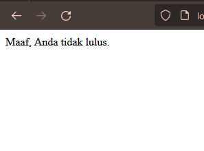

# Web Dinamis
Web dinamis adalah jenis situs web yang mampu menghasilkan konten secara dinamis atau berubah sesuai dengan interaksi pengguna, data yang dimasukkan, atau faktor-faktor lainnya. Berbeda dengan situs web statis yang memiliki konten yang tetap dan tidak berubah tanpa interaksi pengguna, situs web dinamis dapat menghasilkan halaman web yang unik untuk setiap pengguna berdasarkan permintaan atau input yang diberikan.
# PHP
PHP adalah bahasa pemrograman yang sering digunakan untuk mengembangkan aplikasi web dinamis. Singkatan dari "Hypertext Preprocessor", PHP berfungsi sebagai skrip sisi server yang dieksekusi di server web untuk menghasilkan konten dinamis. PHP berinteraksi dengan basis data, mengolah formulir, menghasilkan halaman web, dan melakukan banyak tugas lainnya untuk menciptakan pengalaman pengguna yang dinamis di situs web. Dengan bantuan PHP, pengembang dapat membuat situs web yang menanggapi input pengguna dan menyediakan konten yang dipersonalisasi sesuai kebutuhan.
## Struktur Dasar PHP
```PHP
<?php

$variable = "value";
echo "menampilkan text dan variable dari $variable";

?>
```
```output
menampilkan text dan variable value
```
# Program Pertama PHP (Localhost/WebServer)
Langkah - Langkah Menghubungkan Apache dengan Text Editor(Web server)
1. Open XAMPP app
2. Start Apache in XAMPP
3. Open Fila Manager
4. Open Drive C
5. Open File XAMPP
6. Open htdocs
7. Create New Folder(Folder_name)
8. Open Text Editor app
9. Open Folder_name
10. Add New File PHP in text editor(File.php)S
11. Done

# Echo
- Adalah perintah dalam bahasa pemrograman PHP yang digunakan untuk menampilkan teks atau variabel ke dalam halaman web. Ini memungkinkan pengembang untuk menghasilkan output langsung ke browser pengguna. Misalnya, jika Anda ingin menampilkan teks "Hello, World!" di halaman web menggunakan PHP, Anda dapat melakukannya dengan perintah echo:
**Contoh**
```php
<?
//kutip dua
echo "Hello World";

//Kutip satu
echo 'Hello World';
?>
```
**Penjelasan Kutip 1 & 2**
`''` hanya membaca sebuah string, variabel dan string dipisahkan oleh tanda titik`.`
`""` *kutip dua* bisa membaca nilai dari variabel
# Comentar
- Komentar digunakan dalam kode untuk memberikan penjelasan atau dokumentasi bagi pengembang atau orang lain yang membaca kode. Komentar tidak akan dieksekusi oleh server web dan hanya ada untuk tujuan dokumentasi. Dalam PHP, ada dua jenis komentar: komentar satu baris dan komentar multi-baris.
**Contoh**
```php
// Ini adalah komentar satu baris dalam PHP

/*
Ini adalah komentar
multi-baris dalam PHP
*/
```
# Variabel
 **Variabel**: Variabel adalah simbol yang digunakan untuk menyimpan nilai yang dapat berubah selama jalannya program. Dalam PHP, variabel dinyatakan dengan awalan dolar ($) diikuti dengan nama variabel,
- Variabel adalah tempat penyimpanan untuk nilai-nilai dalam sebuah program.
- Setiap variabel memiliki nama yang unik yang digunakan untuk mengidentifikasinya.
- Variabel dapat menyimpan berbagai jenis data seperti angka, teks, boolean, array, dan lainnya.
```php
$nama = "Rahmat";
$umur = 18;
```
Variabel di atas menyimpan nama "Rahmat" dan umur 18. Nilai variabel ini dapat diubah selama jalannya program.
# Constanta
**Konstanta**: Konstanta adalah nilai yang tetap dan tidak dapat diubah selama jalannya program. Mereka berguna untuk menyimpan nilai yang tidak boleh berubah, seperti nilai pi (π) atau nilai-nilai pengaturan yang tetap. Dalam PHP, konstanta didefinisikan menggunakan fungsi define().
- Konstanta adalah nilai yang tetap dan tidak berubah selama jalannya program.
- Nilai konstanta didefinisikan sekali dan tidak dapat diubah kembali.
- Biasanya digunakan untuk menyimpan nilai-nilai seperti konstanta matematis atau pengaturan yang tetap.
```php
define("PI", 3.14);
echo PI;
```
Dalam contoh di atas, kita mendefinisikan konstanta PI dengan nilai 3.14, kemudian menampilkannya.
# Operator
**Operator**: Operator digunakan untuk melakukan operasi pada variabel dan nilai. Ada berbagai jenis operator dalam pemrograman seperti operator aritmatika, operator perbandingan, dan operator logika. Beberapa operator dasar dalam PHP meliputi:
## Operator Aritmatika
### Pemjumlahan
- **Penjelasan:**
	Penjumlahan (+): Digunakan untuk menambahkan dua nilai bersama-sama
```php
$nilai1 = 10;
$nilai2 = 5;

$penjumlahan = $nilai1 + $nilai2;
echo "Penjumlahan: " . $penjumlahan . "<br>";
```
```output
Penjumlahan: 15
```
- **Analisis**
	Penjumlahan (+):
    - Operator ini digunakan untuk menambahkan dua nilai bersama-sama.
    - Contoh: `$penjumlahan = $nilai1 + $nilai2;`
    - Hasilnya adalah penjumlahan dari nilai `$nilai1` dan `$nilai2`.
- **Kesimpulan**
	- Kesimpulannya, dengan operator ini, kita dapat menambahkan nilai-nilai numerik dalam PHP dengan mudah.
___
### Pengurangan
- **Penjelasan:**
	Pengurangan (-): Digunakan untuk mengurangkan nilai kedua dari nilai pertama.
```php
$nilai1 = 10;
$nilai2 = 5;

$pengurangan = $nilai1 - $nilai2;
echo "Pengurangan: " . $pengurangan . "<br>";
```
```output
Pengurangan: 5
```
- **Analisis**
	Pengurangan (-):
	- Operator ini digunakan untuk mengurangkan nilai kedua dari nilai pertama.
	- Contoh: `$pengurangan = $nilai1 - $nilai2;`
	- Hasilnya adalah pengurangan dari nilai `$nilai2` dari `$nilai1`.
- **Kesimpulan**
	- Kesimpulannya, penggunaan operator ini memungkinkan kita untuk mengurangkan satu nilai dari yang lain dalam pemrograman PHP.
___
### Perkalian
- **Penjelasan**
	Perkalian (*): Digunakan untuk mengalikan dua nilai bersama-sama.
```php
$nilai1 = 10;
$nilai2 = 5;
$perkalian = $nilai1 * $nilai2;
echo "Perkalian: " . $perkalian . "<br>";
```
```output
Perkalian: 50
```
- **Analisis**
	Perkalian (*):
    - Operator ini digunakan untuk mengalikan dua nilai bersama-sama.
    - Contoh: `$perkalian = $nilai1 * $nilai2;`
    - Hasilnya adalah perkalian dari `$nilai1` dan `$nilai2`.
- **Kesimpulan**
	- Kesimpulannya, dengan operator ini, kita dapat melakukan perkalian nilai-nilai numerik dalam PHP untuk mendapatkan hasil perkalian.
___
### Pembagian
- Penjelasan 
	Pembagian (/): Digunakan untuk membagi nilai pertama dengan nilai kedua.
```php
$nilai1 = 10;
$nilai2 = 5;

$pembagian = $nilai1 / $nilai2;
echo "Pembagian: " . $pembagian . "<br>";
```
```output
Pembagian: 2
```
- **Analisis**
	Pembagian (/):
    - Operator ini digunakan untuk membagi nilai pertama dengan nilai kedua.
    - Contoh: `$pembagian = $nilai1 / $nilai2;`
    - Hasilnya adalah pembagian dari nilai `$nilai1` dengan `$nilai2`.
- **Kesimpulan**
	- Kesimpulannya, operator ini memungkinkan kita untuk membagi nilai-niai numerik dalam PHP dan mendapatkan hasil pembagian.
___
### Modulus
- Penjelasan
	Modulus (%): Digunakan untuk mengembalikan sisa pembagian dari nilai pertama dengan nilai kedua.
```php
$nilai1 = 10;
$nilai2 = 5;

$modulus = $nilai1 % $nilai2;
echo "Modulus: " . $modulus . "<br>";
```
```output
Modulus: 0
```
- **Analisis**
	Modulus (%):
    - Operator ini digunakan untuk mengembalikan sisa pembagian dari nilai pertama dengan nilai kedua.
    - Contoh: `$modulus = $nilai1 % $nilai2;`
    - Hasilnya adalah sisa pembagian dari `$nilai1` dengan `$nilai2`.
- **Kesimpulan**
	- Kesimpulannya, dengan menggunakan operator modulus, kita dapat menghitung sisa pembagian dari nilai-nilai numerik dalam PHP.
___
## Operator Perbandingan
- **Penjelasan**
	1. Operator Sama dengan (== ):
     Operator ini digunakan untuk membandingkan apakah dua nilai sama.
     Contohnya, `$a == $b` akan menghasilkan true jika nilai variabel `$a` sama dengan nilai variabel `$b`, dan false jika tidak sama.

	2. Operator Tidak Sama dengan (!=):
     Operator ini digunakan untuk membandingkan apakah dua nilai tidak sama.
     Contohnya, `$a != $b` akan menghasilkan true jika nilai variabel `$a` tidak sama dengan nilai variabel `$b`, dan false jika sama.

	3. Operator Kurang dari (<):
     Operator ini digunakan untuk membandingkan apakah nilai kiri kurang dari nilai kanan.
     Contohnya, `$a < $b` akan menghasilkan true jika nilai variabel `$a` kurang dari nilai variabel `$b`, dan false jika tidak kurang dari.

	4. Operator Lebih Besar dari (>):
     Operator ini digunakan untuk membandingkan apakah nilai kiri lebih besar dari nilai kanan.
     Contohnya, `$a > $b` akan menghasilkan true jika nilai variabel `$a` lebih besar dari nilai variabel `$b`, dan false jika tidak lebih besar dari.

	5. Operator Kurang dari atau Sama dengan (<=):   
     Operator ini digunakan untuk membandingkan apakah nilai kiri kurang dari atau sama dengan nilai kanan.
     Contohnya, `$a <= $b` akan menghasilkan true jika nilai variabel `$a` kurang dari atau sama dengan nilai variabel `$b`, dan false jika tidak kurang dari atau sama dengan.

	6. Operator Lebih Besar dari atau Sama dengan (>=):   
     Operator ini digunakan untuk membandingkan apakah nilai kiri lebih besar dari atau sama dengan nilai kanan.
     Contohnya, `$a >= $b` akan menghasilkan true jika nilai variabel `$a` lebih besar dari atau sama dengan nilai variabel `$b`, dan false jika tidak lebih besar dari atau sama dengan.
    
- **Kode Program**
```php
<?php
$a = 5;
$b = 10;

// Operator sama dengan (==)
if ($a == $b) {
    echo "$a sama dengan $b";
} else {
    echo "$a tidak sama dengan $b";
}
echo "<br>";


// Operator tidak sama dengan (!=)
if ($a != $b) {
    echo "$a tidak sama dengan $b";
} else {
    echo "$a sama dengan $b";
}
echo "<br>";


// Operator kurang dari (<)
if ($a < $b) {
    echo "$a kurang dari $b";
} else {
    echo "$a tidak kurang dari $b";
}
echo "<br>";


// Operator lebih besar dari (>)
if ($a > $b) {
    echo "$a lebih besar dari $b";
} else {
    echo "$a tidak lebih besar dari $b";
}
echo "<br>";


// Operator kurang dari atau sama dengan (<=)
if ($a <= $b) {
    echo "$a kurang dari atau sama dengan $b";
} else {
    echo "$a tidak kurang dari atau sama dengan $b";
}
echo "<br>";


// Operator lebih besar dari atau sama dengan (>=)
if ($a >= $b) {
    echo "$a lebih besar dari atau sama dengan $b";
} else {
    echo "$a tidak lebih besar dari atau sama dengan $b";
}
?>
```
```output
5 tidak sama dengan 10

5 tidak sama dengan 10

5 kurang dari 10

5 tidak lebih besar dari 10

5 kurang dari atau sama dengan 10

5 tidak lebih besar dari atau sama dengan 10

```
- **Analisis**
	- Dua variabel `$a` dan `$b` diinisialisasi dengan nilai numerik, masing-masing 5 dan 10.
	- Program kemudian membandingkan `$a` dan `$b` menggunakan berbagai operator perbandingan dan menampilkan pesan berdasarkan hasil perbandingan.
	- Karena `$a` (5) tidak sama dengan `$b` (10), maka pesan "5 tidak sama dengan 10" akan ditampilkan.
	- Karena `$a` (5) kurang dari `$b` (10), maka pesan "5 kurang dari 10" akan ditampilkan.
	- Karena `$a` (5) tidak lebih besar dari `$b` (10), maka pesan "5 tidak lebih besar dari 10" akan ditampilkan.
	- Karena `$a` (5) kurang dari atau sama dengan `$b` (10), maka pesan "5 kurang dari atau sama dengan 10" akan ditampilkan.
	- Karena `$a` (5) tidak lebih besar dari atau sama dengan `$b` (10), maka pesan "5 tidak lebih besar dari atau sama dengan 10" akan ditampilkan.
- **Kesimpulan**
	- Program ini membantu memahami cara kerja operator perbandingan dalam PHP.
	- Operator perbandingan digunakan untuk membandingkan nilai dan mengontrol alur program berdasarkan hasil perbandingan.
	- Program seperti ini bermanfaat dalam logika pemrograman untuk membuat keputusan berdasarkan kondisi tertentu.
## Operator Logika
- **Penjelasan**
	Dalam PHP, operator logika digunakan untuk menggabungkan kondisi logis dan menghasilkan nilai boolean (true atau false) berdasarkan kebenaran kondisi tersebut. Contoh operator:
	1. **AND (&&):** Menghasilkan true jika kedua kondisi benar.
	2. **OR (||):** Menghasilkan true jika salah satu atau kedua kondisi benar.
	3. **NOT (!):** Membalikkan nilai kondisi, true menjadi false, dan sebaliknya.
```php
<?php
$a = 5;
$b = 10;
$c = 15;

// Operator logika AND (&&)
if ($a < $b && $b < $c) {
    echo "$a kurang dari $b dan $b kurang dari $c";
} else {
    echo "Kondisi AND tidak terpenuhi";
}
echo "<br>";

// Operator logika OR (||)
if ($a > $b || $b > $c) {
    echo "$a lebih besar dari $b atau $b lebih besar dari $c";
} else {
    echo "Kondisi OR tidak terpenuhi";
}
echo "<br>";

// Operator logika NOT (!)
if (!($a == $b)) {
    echo "$a tidak sama dengan $b";
} else {
    echo "$a sama dengan $b";
}
?>

```
```output
5 kurang dari 10 dan 10 kurang dari 15

Kondisi OR tidak terpenuhi

5 tidak sama dengan 10
```
- **Analisis**
	- Kita memiliki tiga variabel `$a`, `$b`, dan `$c` dengan nilai 5, 10, dan 15.
	- Operator logika `AND` digunakan untuk memeriksa apakah `$a` kurang dari `$b` dan `$b` kurang dari `$c`. Jika  keduanya benar, pesan yang sesuai ditampilkan.
	- Operator logika `OR` digunakan untuk memeriksa apakah `$a` lebih besar dari `$b` atau `$b` lebih besar dari `$c`. Jika salah satu atau kedua kondisi benar, pesan yang sesuai ditampilkan.
	- Operator logika `NOT` digunakan untuk membalikkan nilai kondisi `$a` == `$b`. Jika `$a` tidak sama dengan `$b`, pesan yang sesuai ditampilkan.

- **Kesimpulan**
 
	- Kode ini menggunakan operator logika untuk membuat keputusan berdasarkan kondisi-kondisi yang dievaluasi.
	- Operator logika memungkinkan kita untuk menggabungkan kondisi-kondisi logis dan mengontrol alur program berdasarkan kebenaran kondisi tersebut.
	- Dengan menggunakan operator logika, kita dapat membuat program yang lebih kompleks dengan logika yang bergantung pada kondisi-kondisi tertentu.
# Conditional Statement
## If
**Penjelasan:**
Pernyataan if digunakan untuk menjalankan blok kode jika kondisi yang diberikan benar (true)
**Struktur:**
```php
if (kondisi) {
    // Blok kode yang dijalankan jika kondisi benar
}
```
**Contoh Program:**
```PHP
$nilai = 80;

if ($nilai >= 60) {
    echo "Selamat, Anda lulus!";
}
```
**Hasil:**


**Analisis:**

1. Variabel `$nilai` diberikan nilai 80.
2. Pernyataan if digunakan untuk menguji apakah nilai `$nilai` lebih besar atau sama dengan 60.
3. Karena nilai `$nilai` adalah 80 dan memenuhi kondisi `$nilai >= 60`, blok kode di dalam if akan dieksekusi.
4. Blok kode di dalam if hanya berisi perintah untuk mencetak pesan "Selamat, Anda lulus!" menggunakan pernyataan echo.
5. Setelah blok kode di dalam if dieksekusi, program akan berakhir.

**Kesimpulan:**

Jika variabel `$nilai` memiliki nilai 80, maka kondisi `$nilai >= 60` akan benar, sehingga pesan "Selamat, Anda lulus!" akan ditampilkan.
## If-else
**Penjelasan:**
Pernyataan if-else digunakan untuk menjalankan blok kode tertentu jika kondisi benar (true), dan menjalankan blok kode lain jika kondisi salah (false).
**Struktur:**
```php
if (kondisi) {
    // Blok kode yang dijalankan jika kondisi benar
} else {
    // Blok kode yang dijalankan jika kondisi salah
}
```
**Contoh Program:**
```php
$nilai = 50;

if ($nilai >= 60) {
    echo "Selamat, Anda lulus!";
} else {
    echo "Maaf, Anda tidak lulus.";
}
```
**Hasil:**



**Analisis:**

1. Variabel `$nilai` diberikan nilai 50.
2. Pernyataan if digunakan untuk menguji apakah nilai `$nilai` lebih besar atau sama dengan 60.
3. Karena nilai `$nilai` adalah 50 dan tidak memenuhi kondisi `$nilai >= 60`, blok kode di dalam if tidak akan dieksekusi.
4. Karena tidak ada blok kode di dalam if yang dieksekusi, program akan melanjutkan ke blok kode di dalam else.
5. Blok kode di dalam else berisi perintah untuk mencetak pesan "Maaf, Anda tidak lulus." menggunakan pernyataan echo.
6. Setelah blok kode di dalam else dieksekusi, program akan berakhir.

**Kwsimpulan:**

Jika variabel `$nilai` memiliki nilai 50, maka kondisi `$nilai >= 60` akan salah, sehingga pesan "Maaf, Anda tidak lulus." akan ditampilkan.
## if-else-if-else
**Penjelasan:**
Pernyataan if-else-if-else digunakan ketika terdapat beberapa kondisi yang harus diuji secara berurutan.
**Dstruktur:**
```php
if (kondisi1) {
    // Blok kode yang dijalankan jika kondisi1 benar
} elseif (kondisi2) {
    // Blok kode yang dijalankan jika kondisi2 benar
} else {
    // Blok kode yang dijalankan jika semua kondisi salah
}
```
**Contoh Program:**
```php
$nilai = 75;

if ($nilai >= 80) {
    echo "Selamat, Anda mendapatkan nilai A!";
} elseif ($nilai >= 70) {
    echo "Anda mendapatkan nilai B.";
} elseif ($nilai >= 60) {
    echo "Anda mendapatkan nilai C.";
} else {
    echo "Maaf, Anda tidak lulus.";
}
```
**Hasil:**

 
**Analisis:**
1. Variabel `$nilai` diberikan nilai 75.
2. Pernyataan if pertama digunakan untuk menguji apakah nilai `$nilai` lebih besar atau sama dengan 80.
3. Karena nilai `$nilai` tidak mencapai 80, maka blok kode di dalam if pertama tidak akan dieksekusi.
4. Pernyataan elseif pertama digunakan untuk menguji apakah nilai `$nilai` lebih besar atau sama dengan 70.
5. Karena nilai `$nilai` adalah 75 dan memenuhi kondisi `$nilai >= 70`, blok kode di dalam elseif pertama akan dieksekusi.
6. Blok kode di dalam elseif pertama mencetak pesan "Anda mendapatkan nilai B." menggunakan pernyataan echo.
7. Setelah blok kode di dalam elseif pertama dieksekusi, program akan keluar dari struktur kondisional dan berakhir.

**Kesimpulan:**

Jika variabel `$nilai` memiliki nilai 75, maka kondisi `$nilai >= 80` akan salah, namun kondisi `$nilai >= 70` akan benar. Oleh karena itu, pesan "Anda mendapatkan nilai B." akan ditampilkan
## Switch Case
Pernyataan switch case digunakan ketika terdapat beberapa pilihan yang harus diuji.
**Struktur:**
```php
switch (ekspresi) {
    case nilai1:
        // Blok kode yang dijalankan jika ekspresi sama dengan nilai1
        break;
    case nilai2:
        // Blok kode yang dijalankan jika ekspresi sama dengan nilai2
        break;
    default:
        // Blok kode yang dijalankan jika tidak ada case yang cocok
        break;
}
```
**Contoh Program:**
```php
$hari = "Senin";

switch ($hari) {
    case "Senin":
        echo "Hari ini adalah hari Senin.";
        break;
    case "Selasa":
        echo "Hari ini adalah hari Selasa.";
        break;
    default:
        echo "Hari ini bukan hari Senin atau Selasa.";
        break;
}
```
**Hasil:**


**Analisis:**

1. Variabel `$hari` diberikan nilai "Senin".
2. Pernyataan switch digunakan untuk memeriksa nilai dari variabel `$hari`.
3. Kasus pertama (`case "Senin"`) akan dieksekusi jika nilai `$hari` adalah "Senin".
4. Karena nilai `$hari` adalah "Senin", blok kode di dalam kasus pertama akan dieksekusi.
5. Blok kode di dalam kasus pertama mencetak pesan "Hari ini adalah hari Senin." menggunakan pernyataan echo.
6. Setelah blok kode di dalam kasus pertama selesai dieksekusi, pernyataan break digunakan untuk menghentikan eksekusi struktur switch.
7. Program akan keluar dari struktur switch dan berakhir.

**Kesimpulan:**

ika variabel `$hari` memiliki nilai "Senin", maka case pertama akan cocok, dan pesan "Hari ini adalah hari Senin." akan ditampilkan.
# Array
## 1 Dimensi
**Penjelasan:**
Array satu dimensi adalah kumpulan nilai yang disimpan dalam satu variabel dengan indeks berurutan secara numerik.
**Struktur:**
```php
$array = array(nilai1, nilai2, nilai3, ...);
```
**Contoh Program:**
```php
$buah = array("Apel", "Jeruk", "Mangga");
echo $buah[0]; // Output: Apel
echo $buah[1]; // Output: Jeruk
echo $buah[2]; // Output: Mangga
```
**Hasil:**


**Analisis:**

1. Baris pertama mendefinisikan variabel `$buah` sebagai array dengan tiga elemen: "Apel", "Jeruk", dan "Mangga".
2. Baris kedua (`echo $buah[0];`) mencetak nilai buah yang berada pada indeks 0, yaitu "Apel".
3. Baris ketiga (`echo $buah[1];`) mencetak nilai buah yang berada pada indeks 1, yaitu "Jeruk".
4. Baris keempat (`echo $buah[2];`) mencetak nilai buah yang berada pada indeks 2, yaitu "Mangga".

**Kesimpulan:**

Program ini menggunakan array satu dimensi untuk menyimpan dan mengakses kumpulan nilai buah. Dengan menggunakan indeks numerik, kita dapat mengakses nilai buah tertentu dalam array. Dalam contoh ini, program mencetak nilai buah "Apel", "Jeruk", dan "Mangga" sesuai dengan indeks yang ditentukan.
## Asosiatif
**Penjelasan:**
Array asosiatif adalah kumpulan nilai yang disimpan dalam satu variabel dengan indeks berupa kunci (key) yang dapat ditentukan sendiri.
**Struktur:**
```php
$array = array(
    "kunci1" => nilai1,
    "kunci2" => nilai2,
    "kunci3" => nilai3,
    ...
);
```
**Contoh Program:**
```php
$mahasiswa = array(
    "nama" => "John Doe",
    "nim" => "123456",
    "jurusan" => "Teknik Informatika"
);
echo $mahasiswa["nama"]; // Output: John Doe
echo $mahasiswa["nim"]; // Output: 123456
echo $mahasiswa["jurusan"]; // Output: Teknik Informatika
```
**Hasil:**


**Analisis:**

1. Baris pertama mendefinisikan variabel `$mahasiswa` sebagai array asosiatif dengan tiga pasangan kunci-nilai: "nama" dengan nilai "John Doe", "nim" dengan nilai "123456", dan "jurusan" dengan nilai "Teknik Informatika".
2. Baris kedua (`echo $mahasiswa["nama"];`) mencetak nilai yang terkait dengan kunci "nama", yaitu "John Doe".
3. Baris ketiga (`echo $mahasiswa["nim"];`) mencetak nilai yang terkait dengan kunci "nim", yaitu "123456".
4. Baris keempat (`echo $mahasiswa["jurusan"];`) mencetak nilai yang terkait dengan kunci "jurusan", yaitu "Teknik Informatika".

**Kesimpulan:**

Program ini menggunakan array asosiatif untuk menyimpan dan mengakses informasi tentang seorang mahasiswa. Dengan menggunakan kunci yang ditentukan sendiri, kita dapat mengakses nilai-nilai yang terkait dengan kunci tersebut dalam array. Dalam contoh ini, program mencetak informasi nama, nim, dan jurusan mahasiswa sesuai dengan kunci yang ditentukan.
## Multidimensi
**Penjelasan:**
Array multidimensi adalah array yang berisi array di dalamnya, sehingga membentuk struktur data berlapis.
**Struktur:**
```php
$array = array(
    array(nilai1, nilai2, nilai3, ...),
    array(nilai4, nilai5, nilai6, ...),
    ...
);
```
**Contoh Program:**
```php
$matriks = array(
    array(1, 2, 3),
    array(4, 5, 6),
    array(7, 8, 9)
);
echo $matriks[0][0]; // Output: 1
echo $matriks[1][1]; // Output: 5
echo $matriks[2][2]; // Output: 9
```
**Hasil:**


**Analisis:**

1. Baris pertama mendefinisikan variabel `$matriks` sebagai array multidimensi yang terdiri dari tiga array dalam array. Setiap array dalam array tersebut merepresentasikan satu baris dalam matriks.
    - Baris pertama matriks: array(1, 2, 3)
    - Baris kedua matriks: array(4, 5, 6)
    - Baris ketiga matriks: array(7, 8, 9)
2. Baris kedua (`echo $matriks[0][0];`) mencetak nilai yang terletak pada baris pertama (indeks 0) dan kolom pertama (indeks 0) dalam matriks. Outputnya adalah 1.
3. Baris ketiga (`echo $matriks[1][1];`) mencetak nilai yang terletak pada baris kedua (indeks 1) dan kolom kedua (indeks 1) dalam matriks. Outputnya adalah 5.
4. Baris keempat (`echo $matriks[2][2];`) mencetak nilai yang terletak pada baris ketiga (indeks 2) dan kolom ketiga (indeks 2) dalam matriks. Outputnya adalah 9.

**Kesimpulan:**

Program ini menggunakan array multidimensi untuk menyimpan dan mengakses matriks angka. Dengan menggunakan indeks berlapis, kita dapat mengakses nilai-nilai yang terletak pada baris dan kolom tertentu dalam matriks. Dalam contoh ini, program mencetak nilai-nilai dalam matriks sesuai dengan indeks yang ditentukan.
# Var Dump
**Penjelasan:**
`var_dump()` adalah fungsi bawaan PHP yang menampilkan informasi tentang sebuah variabel. Fungsi ini sangat berguna untuk debugging dan memahami struktur data yang kompleks, terutama array asosiatif dan multidimensi.
**Struktur:**
```php
var_dump(mixed $expression, mixed $...);
```
**Contoh Program:**
```php
<?php

$data = array(
    "nama" => "John Doe",
    "umur" => 30,
    "hobi" => array("membaca", "menulis", "bermain game")
);

$data2 = array(
    array("nama" => "Jane Smith", "umur" => 25),
    array("nama" => "Peter Pan", "umur" => 15)
);

var_dump($data);
var_dump($data2);

?>
```
**Hasil:**


**Analisis:**

1. Deklarasi Array:
- **`$data`**: Array asosiatif dengan tiga elemen:
    - `nama`: Berisi string "John Doe".
    - `umur`: Berisi integer 30.
    - `hobi`: Berisi array dengan tiga string: "membaca", "menulis", "bermain game".
- **`$data2`**: Array multidimensi dengan dua elemen:
    - Elemen pertama: Array asosiatif dengan dua elemen:
        - `nama`: Berisi string "Jane Smith".
        - `umur`: Berisi integer 25.
    - Elemen kedua: Array asosiatif dengan dua elemen:
        - `nama`: Berisi string "Peter Pan".
        - `umur`: Berisi integer 15.

2. Penggunaan `var_dump()`:
- **`var_dump($data);`**: Menampilkan informasi tentang array `$data`. Output akan menunjukkan bahwa `$data` adalah array asosiatif dengan tiga elemen, dan akan menampilkan nilai dari setiap elemen.
- **`var_dump($data2);`**: Menampilkan informasi tentang array `$data2`. Output akan menunjukkan bahwa `$data2` adalah array multidimensi dengan dua elemen, dan akan menampilkan informasi tentang setiap elemen, termasuk elemen-elemen yang merupakan array asosiatif.

**Kesimpulan:**
  
Program ini mendemonstrasikan bagaimana `var_dump()` dapat digunakan untuk menampilkan informasi tentang array asosiatif dan multidimensi. Program ini juga menunjukkan bagaimana struktur array yang berbeda dapat ditampilkan menggunakan `var_dump()`.
# Looping/Perulangan
## For
**Penjelasan:**
Perulangan for digunakan ketika kita mengetahui jumlah iterasi yang akan dilakukan.
**Struktur:**
```php
for (inisialisasi; kondisi; perubahan) {
    // blok kode yang akan diulang
}
```
**Contoh Program:**
```php
for ($i = 1; $i <= 5; $i++) {
    echo $i;
}
```
**Hasil:**


**Analisis:**

- Pada awal perulangan, variabel `$i` diinisialisasi dengan nilai 1.
- Kondisi perulangan adalah `$i <= 5`, yang berarti perulangan akan terus berjalan selama nilai `$i` kurang dari atau sama dengan 5.
- Setiap kali iterasi perulangan dilakukan, blok kode di dalamnya akan dijalankan. Pada contoh ini, blok kode hanya mencetak nilai `$i` menggunakan perintah `echo`.
- Setelah blok kode dijalankan, variabel `$i` akan bertambah satu menggunakan operator penambahan `$i++`.
- Proses ini akan terus berlanjut hingga kondisi perulangan tidak terpenuhi, yaitu saat nilai `$i` lebih dari 5.
- Output dari program ini akan mencetak angka 1 sampai 5 secara berurutan.

**Kesimpulan:**
  
Program ini akan mencetak angka dari 1 sampai 5. Hal ini dikarenakan perulangan `for` akan mengulangi blok kode di dalamnya selama kondisi `$i <= 5` bernilai `true`. Setiap iterasi, angka `$i` akan ditampilkan menggunakan perintah `echo`.
## While
**Penjelasan:**
Perulangan while digunakan ketika kita ingin melakukan iterasi selama kondisi bernilai true.
**Struktur:**
```php
while (kondisi) {
    // blok kode yang akan diulang
    // perubahan kondisi harus dilakukan di dalam blok kode
}
```
**Contoh Program:**
```php
$i = 1;
while ($i <= 5) {
    echo $i;
    $i++;
}
```
**Hasil:**


**Analisis:**

- Pada awal program, variabel `$i` diinisialisasi dengan nilai 1.
- Kondisi perulangan adalah `$i <= 5`, yang berarti perulangan akan terus berjalan selama nilai `$i` kurang dari atau sama dengan 5.
- Setiap kali iterasi perulangan dilakukan, blok kode di dalamnya akan dijalankan. Pada contoh ini, blok kode mencetak nilai `$i` menggunakan perintah `echo`.
- Setelah blok kode dijalankan, variabel `$i` akan bertambah satu menggunakan operator penambahan `$i++`.
- Proses ini akan terus berlanjut selama kondisi perulangan terpenuhi, yaitu saat nilai `$i` kurang dari atau sama dengan 5.
- Output dari program ini akan mencetak angka 1 sampai 5 secara berurutan.

**Kesimpulan:**
  
Program ini akan mencetak angka dari 1 sampai 5. Perulangan `while` akan menjalankan blok kode di dalamnya selama kondisi `$i <= 5` bernilai `true`. Setiap iterasi, angka `$i` akan ditampilkan menggunakan perintah `echo`. Variabel `$i` akan terus bertambah satu setiap kali iterasi dengan menggunakan operator penambahan `$i++`.
## Do While
**Penjelasan:**
Perulangan do while mirip dengan perulangan while, namun blok kode akan dijalankan setidaknya satu kali sebelum melakukan pengecekan kondisi.
**Struktur:**
```php
do {
    // blok kode yang akan diulang
    // perubahan kondisi harus dilakukan di dalam blok kode
} while (kondisi);
```
**Contoh Program:**
```php
$i = 1;
do {
    echo $i;
    $i++;
} while ($i <= 5);
```
**Hasil:**


**Analisis:**

- Pada awal program, variabel `$i` diinisialisasi dengan nilai 1.
- Blok kode di dalam perulangan `do-while` akan dijalankan setidaknya satu kali sebelum kondisi perulangan dievaluasi.
- Pada blok kode pertama, nilai `$i` dicetak menggunakan perintah `echo`.
- Setelah blok kode dijalankan, variabel `$i` akan bertambah satu menggunakan operator penambahan `$i++`.
- Setelah itu, kondisi perulangan `$i <= 5` dievaluasi. Jika kondisi tersebut bernilai `true`, maka perulangan akan kembali ke blok kode awal dan dilanjutkan. Jika kondisi bernilai `false`, perulangan akan berhenti dan program akan melanjutkan eksekusi ke instruksi selanjutnya setelah perulangan.
- Proses ini akan terus berlanjut selama kondisi perulangan terpenuhi, yaitu saat nilai `$i` kurang dari atau sama dengan 5.
- Output dari program ini akan mencetak angka 1 sampai 5 secara berurutan.

**Kesimpulan:**

Program ini akan mencetak angka dari 1 sampai 5. Perulangan `do-while` akan menjalankan blok kode di dalamnya setidaknya satu kali sebelum kondisi perulangan dievaluasi. Setiap iterasi, angka `$i` akan ditampilkan menggunakan perintah `echo`. Variabel `$i` akan terus bertambah satu setiap kali iterasi dengan menggunakan operator penambahan `$i++`. Perulangan akan berlanjut selama kondisi `$i <= 5` bernilai `true`.
## Foreach
**Penjelasan:**
Perulangan foreach digunakan khusus untuk mengiterasi elemen-elemen dalam array atau objek.
**Struktur:**
```php
foreach ($array as $nilai) {
    // blok kode yang akan diulang
}
```
**Contoh Program:**
```php
$buah = array("Apel", "Jeruk", "Mangga");
foreach ($buah as $namaBuah) {
    echo $namaBuah;
}
```
**Hasil:**


**Analisis:**

- Pada awal program, terdapat sebuah array `$buah` yang berisi tiga elemen: "Apel", "Jeruk", dan "Mangga".
- Perulangan `foreach` digunakan untuk mengiterasi setiap elemen dalam array `$buah`.
- Pada setiap iterasi, nilai dari elemen saat ini disimpan dalam variabel `$namaBuah`.
- Blok kode di dalam perulangan akan dijalankan untuk setiap elemen dalam array `$buah`. Pada contoh ini, blok kode mencetak nilai `$namaBuah` menggunakan perintah `echo`.
- Setelah iterasi selesai, perulangan akan berlanjut ke elemen berikutnya dalam array hingga semua elemen telah diproses.
- Output dari program ini akan mencetak nilai dari setiap elemen dalam array `$buah`, yaitu "Apel", "Jeruk", dan "Mangga".

**Kesimpulan:**

Program ini akan mencetak nilai dari setiap elemen dalam array `$buah`, yaitu "Apel", "Jeruk", dan "Mangga". Perulangan `foreach` digunakan untuk mengakses dan memproses setiap elemen dalam array tanpa perlu mengelola indeks secara manual. Pada setiap iterasi, nilai elemen saat ini disimpan dalam variabel `$namaBuah`, yang kemudian dicetak menggunakan perintah `echo`.
# Function
**Penjelasan:**
Function dalam bahasa PHP adalah blok kode yang diberi nama dan digunakan untuk menjalankan tugas tertentu. Function memungkinkan kita untuk mengorganisir kode menjadi bagian yang terpisah dan dapat digunakan kembali di berbagai bagian dalam program. Dengan menggunakan function, kita dapat mengelompokkan kode yang memiliki fungsi serupa dan mempermudah pemeliharaan dan pengembangan program.
**Struktur:**
```php
function nama_function(parameter1, parameter2, ...) {
    // Blok kode yang dijalankan ketika function dipanggil
    // ...
    return nilai;
}
```
**Contoh Program:**
```php
function tambah($a, $b) {
    $hasil = $a + $b;
    return $hasil;
}

$angka1 = 5;
$angka2 = 3;
$hasil_penjumlahan = tambah($angka1, $angka2);

echo "Hasil penjumlahan: " . $hasil_penjumlahan;
```
**Hasil:**


**Analisis:**

- Dalam contoh program di atas, kita mendefinisikan sebuah function bernama `tambah` yang menerima dua parameter `$a` dan `$b`.
- Di dalam function `tambah`, kita menambahkan nilai dari parameter `$a` dan `$b` dan menyimpan hasilnya di variabel `$hasil`.
- Kemudian, kita mengembalikan nilai `$hasil` menggunakan pernyataan `return`.
- Di luar function, kita mendefinisikan dua variabel `$angka1` dan `$angka2` yang akan digunakan sebagai argumen saat memanggil function `tambah`.
- Hasil penjumlahan dari function `tambah` disimpan di variabel `$hasil_penjumlahan`.
- Akhirnya, kita mencetak hasil penjumlahan menggunakan pernyataan `echo`.

**Kesimpulan:**

Program ini menggunakan function `tambah` untuk menjumlahkan dua angka dan mencetak hasilnya. Penggunaan function memungkinkan kita untuk mengorganisir kode menjadi blok yang terpisah dan dapat digunakan kembali. Keuntungan menggunakan function antara lain:
- Modularitas: Kode penjumlahan dipisahkan ke dalam function `tambah`, sehingga memudahkan pemeliharaan dan pengembangan kode. Jika ada perubahan pada logika penjumlahan, kita hanya perlu memodifikasi function `tambah`, bukan seluruh program.
- Reusabilitas: Function `tambah` dapat dipanggil berkali-kali dengan argumen yang berbeda. Kita dapat menggunakan kembali function ini di berbagai bagian program yang membutuhkan operasi penjumlahan.
- Keterbacaan: Penggunaan function dengan nama yang deskriptif, seperti `tambah`, membuat kode lebih mudah dipahami dan mempermudah pemahaman terhadap fungsi yang dilakukan oleh blok kode tersebut.
# PHP Form
## Get Method
**Penjelasan:**
Metode GET adalah salah satu metode pengiriman data dari client ke server dalam protokol HTTP. Dalam PHP, kita dapat menggunakan metode GET untuk mengirim data melalui URL.
**Struktur:**
```php
<?php

// Dapatkan nilai parameter
$q = $_GET['q'];

// Lakukan sesuatu dengan data yang dikirimkan
echo "Anda mencari: $q<br>";

?>
```
**Contoh Program:**
```html
<!DOCTYPE html>
<html>
<head>
    <title>Form GET</title>
</head>
<body>
    <form method="GET" action="test2.php">
        <label for="name">Nama:</label>
        <input type="text" name="name" id="name">
        <br>
        <label for="age">Usia:</label>
        <input type="text" name="age" id="age">
        <br>
        <input type="submit" value="Submit">
    </form>
</body>
</html>
```
```php
<?php
if (isset($_GET['name']) && isset($_GET['age'])) {
    $name = $_GET['name'];
    $age = $_GET['age'];
  
    echo "Nama: " . $name . "<br>";
    echo "Usia: " . $age;
}
?>
```
**Hasil:**


**Aanlisis:**

1. Bagian HTML:
    - Program HTML ini menampilkan sebuah form dengan metode GET yang mengirimkan data ke file "test2.php" saat tombol "Submit" ditekan.
    - Form memiliki dua input field yaitu "Nama" dan "Usia" yang masing-masing memiliki atribut name yang sesuai.
    - Ketika tombol "Submit" ditekan, data yang diisi oleh pengguna akan dikirimkan ke file "test2.php" untuk diproses.
2. Bagian PHP:
    - Program PHP ini berada di bawah tag penutup HTML (`?>`) dan akan dieksekusi saat form dikirimkan.
    - Program menggunakan `isset()` untuk memeriksa apakah parameter `name` dan `age` telah dikirim melalui metode GET.
    - Jika parameter tersebut ada dalam URL, program akan mengambil nilai-nilainya menggunakan `$_GET['name']` dan `$_GET['age']`.
    - Selanjutnya, program akan menampilkan nilai-nilai tersebut dengan menggunakan echo untuk mencetak pesan "Nama: [nama]" dan "Usia: [usia]" di halaman.

**Kesimpulan:**

Program tersebut adalah contoh sederhana yang menggunakan metode GET dalam PHP untuk mengambil data yang dikirim melalui form HTML. Ketika form dikirimkan, data yang diisi oleh pengguna akan dikirim melalui URL sebagai parameter dan nilai yang dapat diakses melalui `$_GET` di file "test2.php". Program kemudian mengambil nilai-nilai tersebut dan menampilkannya di halaman dengan menggunakan `echo`.
Pastikan file "test2.php" tersedia dan dapat diakses dengan benar serta server web Anda telah dikonfigurasi untuk menjalankan PHP. Setelah form dikirimkan, Anda akan melihat pesan "Nama: [nama]" dan "Usia: [usia]" di halaman "test2.php" sesuai dengan data yang diisi oleh pengguna.
## Post Method

**Penjelasan:**

Metode POST digunakan untuk mengirimkan data dari client ke server. Data dikirimkan dalam tubuh permintaan HTTP dan tidak terlihat dalam URL seperti metode GET. Metode POST lebih aman untuk mengirim data sensitif seperti kata sandi. Dalam PHP, data yang dikirim melalui metode POST dapat diakses menggunakan variabel global `$_POST`.
**Struktur:**
```php
<?php

// Periksa apakah formulir telah dikirimkan
if ($_SERVER['REQUEST_METHOD'] === 'POST') {

  // Dapatkan nilai field formulir
  $name = $_POST['name'];
  $email = $_POST['email'];

  // Lakukan sesuatu dengan data yang dikirimkan
  echo "Nama: $name<br>";
  echo "Email: $email<br>";
}

?>
```
**Contoh Program:**
```html
<html lang="en">
<head>
    <title>Document</title>
</head>
<body>
    <!-- Pada atribut action, kalian tuliskan nama file php yang bertugas untuk mengelola atau menangkap data dari form tersebut. -->
    <form action="proses_post.php" method="POST">
        <input type="text" name="nama_lengkap" placeholder="Masukkan nama">
        <input type="number" name="umur" placeholder="Masukkan umur">
        <input type="password" name="password" placeholder="Masukkan password"><br>
        <button type="submit">Kirim</button>
    </form>
</body>
</html>
```
```php
<?php

// Key dari array-nya, sesuai dengan nama dari atribut name di setiap input-nya
$nama = $_POST["nama"];
$umur = $_POST["umur"];
  
var_dump($_POST);
?>
  
<!DOCTYPE html>
<html lang="en">
<head>
    <title> XI RPL 1 - POST</title>
</head>
<body>
    <p>Nama anda <?= $_POST["nama_lengkap"] ?></p>
    <p>Umur anda <?= $umur ?> tahun</p>
    <p>Password anda aman!</p>
</body>
</html>
```
**Hasil:**


**Aanlisis:**

1. Pada bagian HTML:
    - Terdapat sebuah form dengan atribut `action` yang berisi "proses_post.php", yang menunjukkan bahwa data akan dikirim ke file "proses_post.php" untuk diproses.
    - Form tersebut menggunakan metode POST dengan atribut `method="POST"`.
    - Terdapat tiga input field yaitu "nama_lengkap", "umur", dan "password" yang akan dikirimkan ke file "proses_post.php".
    - Terdapat tombol submit dengan teks "Kirim", yang akan mengirimkan data form saat ditekan.
2. Pada bagian PHP di file "proses_post.php":
    - Data yang dikirim melalui form akan ditangkap menggunakan variabel `$_POST` dengan key yang sesuai dengan atribut `name` pada input field.
    - Terdapat variabel `$nama` dan `$umur` yang ditugaskan dengan nilai dari `$_POST["nama"]` dan `$_POST["umur"]` secara berturut-turut. Namun, di form HTML tidak ada input field dengan atribut `name="nama"`, sehingga ini dapat menyebabkan kesalahan ketika mencoba mengakses nilai tersebut.
    - Terdapat fungsi `var_dump($_POST)` yang digunakan untuk menampilkan semua data yang diterima melalui metode POST. Fungsi ini berguna untuk debugging dan melihat nilai-nilai yang diterima.
    - Setelah itu, program melanjutkan ke bagian HTML di bawahnya.
3. Kembali ke bagian HTML di file yang sama:
    - Terdapat beberapa elemen `<p>` yang menampilkan hasil dari data yang diterima.
    - Pada elemen `<p>` pertama, menggunakan `$_POST["nama_lengkap"]` untuk menampilkan nilai dari input field "nama_lengkap" yang dikirim melalui metode POST.
    - Pada elemen `<p>` kedua, menggunakan variabel `$umur` yang telah diisi dengan nilai dari `$_POST["umur"]` untuk menampilkan nilai umur.
    - Pada elemen `<p>` ketiga, menampilkan pesan statis "Password anda aman!".

**Kesimpulan:**

Program ini adalah sebuah halaman HTML dengan form yang mengirim data menggunakan metode POST. Data yang dikirim kemudian ditangkap di file "proses_post.php" menggunakan variabel `$_POST`. Namun, ada ketidaksesuaian antara atribut `name` pada input field dengan variabel yang digunakan di PHP. Sehingga, program ini perlu diperbaiki dengan mengganti atribut `name="nama_lengkap"` menjadi `name="nama"` agar sesuai dengan variabel yang digunakan di PHP. Selain itu, program juga bisa ditingkatkan dengan penanganan data yang lebih baik, seperti validasi input, sanitasi data, dan penggunaan metode keamanan yang lebih baik untuk mengelola password.
# PHP MYSQL

# Koneksi DataBase
**Kode Program:**
```php
<php

//koneksi ke database
$koneksi = mysqli_connect('localhost', 'root', '', 'rental_rahmat');
  
if ($koneksi) {
    echo "<br> koneksi aman <br>";
} else {
     echo "error, tidak bisa koneksi ke database";
}

  
//jalankan query seleksi
//$select = mysqli_query($koneksi, "SELECT * FROM daftar_mobil");
  
// //membuat array dan memecah data berdasarkan kolomnya
// $result = mysqli_fetch_assoc($select);

// //menampilkan struktur array dari data tabel yang dijalankan di atas
// // var_dump($result);


// echo 'Berikut nama-nama pemilik mobil<br>';

// $a = 1; 
// foreach($select as $key => $data){

//     echo $a++ . ", " . $data ['no_plat'] . " : " . $data ['pemilik'] . '<br>';

// }


// // echo '<p>Halo ' . $result['pemilik'] . '!!</p><br>';
```
**Hasil:**

**Analisis:**
1. Koneksi ke database:
	- Menggunakan fungsi `mysqli_connect()` untuk membuat koneksi ke database MySQL dengan parameter host ('localhost'), username ('root'), password (''), dan nama database ('rental_rahmat').
	- Jika koneksi berhasil, maka pesan "koneksi aman" akan ditampilkan. Jika tidak, pesan "error, tidak bisa koneksi ke database" akan ditampilkan.

**Kesimpulan:**

Program PHP dan SQL di atas bertujuan untuk melakukan koneksi ke database MySQL menggunakan fungsi `mysqli_connect()`. Setelah koneksi berhasil, pesan "koneksi aman" akan ditampilkan. Jika terdapat masalah dalam koneksi, maka pesan "error, tidak bisa koneksi ke database" akan ditampilkan.
Namun, pada kode yang diberikan, tag pembuka PHP ditulis sebagai "<php" yang seharusnya "<php" (dengan tanda "?"). Pastikan untuk mengubahnya menjadi "<php" agar kode PHP dapat dieksekusi dengan benar.
# Tampilkan Data
**Kode Program:**
```php
<?php

//koneksi ke database
$koneksi = mysqli_connect('localhost', 'root', '', 'rental_rahmat');
  
if ($koneksi) {
    echo "<br> koneksi aman <br>";
} else {
    echo "error, tidak bisa koneksi ke database";
}
  
//jalankan query seleksi
$select = mysqli_query($koneksi, "SELECT * FROM daftar_mobil");

// //membuat array dan memecah data berdasarkan kolomnya
// $result = mysqli_fetch_assoc($select);
  
//menampilkan struktur array dari data tabel yang dijalankan di atas
// var_dump($result);
  
echo 'Berikut nama-nama pemilik mobil<br>';

$a = 1;
foreach($select as $key => $data){
    echo $a++ . ", " . $data ['no_plat'] . " : " . $data ['pemilik'] . '<br>';
}
  
// echo '<p>Halo ' . $result['pemilik'] . '!!</p><br>';
```
**Hasil:**


**Analisis:**
1. Koneksi ke database:
    - Menggunakan fungsi `mysqli_connect()` untuk membuat koneksi ke database MySQL dengan parameter host ('localhost'), username ('root'), password (''), dan nama database ('rental_rahmat').
    - Jika koneksi berhasil, maka pesan "koneksi aman" akan ditampilkan. Jika tidak, pesan "error, tidak bisa koneksi ke database" akan ditampilkan.
2. Jalankan query seleksi:
    - Menggunakan fungsi `mysqli_query()` untuk menjalankan query SQL yang melakukan seleksi data dari tabel "daftar_mobil" dalam database.
    - Hasil query disimpan dalam variabel `$select`.
3. Menampilkan data:
    - Menampilkan pesan "Berikut nama-nama pemilik mobil" sebagai judul.
    - Menggunakan perulangan `foreach` untuk mengiterasi setiap baris data yang ditemukan dalam `$select`.
    - Setiap baris data ditampilkan dengan format nomor plat mobil dan nama pemiliknya.

**Kesimpulan:**

Program PHP dan SQL di atas berfungsi untuk melakukan koneksi ke database, menjalankan query seleksi, dan menampilkan data dari tabel "daftar_mobil". Program ini akan menampilkan nama-nama pemilik mobil yang ada dalam tabel tersebut dengan format nomor plat dan nama pemilik.
Namun, perlu diperhatikan bahwa bagian yang mengakses data menggunakan `$select` dalam perulangan `foreach` tidak tepat. Seharusnya, variabel `$select` diganti dengan `mysqli_fetch_assoc($select)` untuk mengambil setiap baris data secara berurutan. Dalam kode yang diberikan, perulangan `foreach` tidak akan berfungsi dengan benar. Jika ingin menampilkan semua baris data, perlu dilakukan perubahan pada kode tersebut.
# Tambahkan Data
**Kode Program:**
```php
<?php
  
//koneksi ke database
$koneksi = mysqli_connect('localhost', 'root', '', 'rental_rahmat');

if ($koneksi) {
    echo "<br> koneksi aman <br>";
} else {
    echo "error, tidak bisa koneksi ke database";
}


//jalankan query seleksi
$select = mysqli_query($koneksi, "SELECT * FROM daftar_mobil");
  

//menampilkan struktur array dari data tabel yang dijalankan di atas
// var_dump($result);
  

echo 'Berikut nama-nama pemilik mobil<br>';
  
$a = 1;
foreach($select as $key => $data){
    echo $a++ . ", " . $data['no_plat'] . " : " . $data['pemilik'] . '<br>';
}
  
//Tambahkan data baru ke tabel daftar_mobil
$no_plat_baru = "AB 1234 CD";
$pemilik_baru = "John Doe";
  
$insert = mysqli_query($koneksi, "INSERT INTO daftar_mobil (no_plat, pemilik) VALUES ('$no_plat_baru', '$pemilik_baru')");
  
if ($insert) {
    echo "Data baru berhasil ditambahkan ke tabel daftar_mobil";
} else {
    echo "Gagal menambahkan data baru ke tabel daftar_mobil";
}

// echo '<p>Halo ' . $result['pemilik'] . '!!</p><br>';

?>
```
**Hasil:**


**Analisis:**
1. Koneksi ke database:
    - Menggunakan fungsi `mysqli_connect()` untuk membuat koneksi ke database MySQL dengan parameter host ('localhost'), username ('root'), password (''), dan nama database ('rental_rahmat').
    - Jika koneksi berhasil, maka pesan "koneksi aman" akan ditampilkan. Jika tidak, pesan "error, tidak bisa koneksi ke database" akan ditampilkan.
2. Jalankan query seleksi:
    - Menggunakan fungsi `mysqli_query()` untuk menjalankan query SQL yang melakukan seleksi data dari tabel "daftar_mobil" dalam database.
    - Hasil query disimpan dalam variabel `$select`.
3. Menampilkan data:
    - Menampilkan pesan "Berikut nama-nama pemilik mobil" sebagai judul.
    - Menggunakan perulangan `foreach` untuk mengiterasi setiap baris data yang ditemukan dalam `$select`.
    - Setiap baris data ditampilkan dengan format nomor plat mobil dan nama pemiliknya.
4. Menambahkan data baru:
    - Menambahkan data baru ke tabel "daftar_mobil" dengan menggunakan fungsi `mysqli_query()` untuk menjalankan query SQL INSERT.
    - Data baru yang ditambahkan adalah nomor plat baru dan pemilik baru yang disimpan dalam variabel `$no_plat_baru` dan `$pemilik_baru`.

**Kesimpulan:**

Program PHP dan SQL di atas berfungsi untuk melakukan koneksi ke database, menjalankan query seleksi, menampilkan data dari tabel "daftar_mobil", dan menambahkan data baru ke tabel tersebut. Program ini akan menampilkan nama-nama pemilik mobil yang ada dalam tabel, kemudian menambahkan data baru dengan nomor plat dan pemilik yang ditentukan.
Harap diingat bahwa sebelum menjalankan program ini, pastikan koneksi ke database telah berhasil dan struktur tabel "daftar_mobil" telah sesuai. Juga, perhatikan bahwa program ini menggunakan data yang telah ditentukan sebelumnya untuk penambahan data baru. Anda dapat mengubah nilai variabel `$no_plat_baru` dan `$pemilik_baru` sesuai dengan data yang ingin ditambahkan.
# Ubah Data
**Kode Program:**
```php
<?php
  
//koneksi ke database
$koneksi = mysqli_connect('localhost', 'root', '', 'rental_rahmat');

if ($koneksi) {
    echo "<br> koneksi aman <br>";
} else {
    echo "error, tidak bisa koneksi ke database";
}

//jalankan query seleksi
$select = mysqli_query($koneksi, "SELECT * FROM daftar_mobil");
  
echo 'Berikut nama-nama pemilik mobil sebelum perubahan<br>';
  
$a = 1;
foreach($select as $key => $data){
    echo $a++ . ", " . $data['no_plat'] . " : " . $data['pemilik'] . '<br>';
}

//Ubah data dalam tabel daftar_mobil
$no_plat_lama = "AB 1234 CD";
$pemilik_baru = "Amir";

$update = mysqli_query($koneksi, "UPDATE daftar_mobil SET pemilik='$pemilik_baru' WHERE no_plat='$no_plat_lama'");

if ($update) {
    echo "Data berhasil diubah";
} else {
    echo "Gagal mengubah data";
}

//jalankan query seleksi setelah perubahan
$select_after_update = mysqli_query($koneksi, "SELECT * FROM daftar_mobil");

echo 'Berikut nama-nama pemilik mobil setelah perubahan<br>';

$a = 1;
foreach($select_after_update as $key => $data){
    echo $a++ . ", " . $data['no_plat'] . " : " . $data['pemilik'] . '<br>';
}

?>
```
**Hasil:**


**Analisis:**

1. Koneksi ke database:
    - Menggunakan fungsi `mysqli_connect()` untuk membuat koneksi ke database MySQL dengan parameter host ('localhost'), username ('root'), password (''), dan nama database ('rental_rahmat').
    - Jika koneksi berhasil, maka pesan "koneksi aman" akan ditampilkan. Jika tidak, pesan "error, tidak bisa koneksi ke database" akan ditampilkan.
2. Jalankan query seleksi:
    - Menggunakan fungsi `mysqli_query()` untuk menjalankan query SQL yang melakukan seleksi data dari tabel "daftar_mobil" dalam database.
    - Hasil query disimpan dalam variabel `$select`.
3. Menampilkan data sebelum perubahan:
    - Menampilkan pesan "Berikut nama-nama pemilik mobil sebelum perubahan" sebagai judul.
    - Menggunakan perulangan `foreach` untuk mengiterasi setiap baris data yang ditemukan dalam `$select`.
    - Setiap baris data ditampilkan dengan format nomor plat mobil dan nama pemiliknya.
4. Ubah data dalam tabel daftar_mobil:
    - Menggunakan query SQL UPDATE untuk mengubah data dalam tabel daftar_mobil.
    - Data yang akan diubah adalah pemilik mobil dengan nomor plat lama yang disimpan dalam variabel `$no_plat_lama`, dengan pemilik baru yang ditetapkan dalam variabel `$pemilik_baru.
5. Menampilkan data setelah perubahan:
    - Menampilkan pesan "Berikut nama-nama pemilik mobil setelah perubahan" sebagai judul.
    - Menjalankan query seleksi lagi setelah perubahan.
    - Menggunakan perulangan `foreach` untuk mengiterasi setiap baris data yang ditemukan dalam `$select_after_update`.
    - Setiap baris data ditampilkan dengan format nomor plat mobil dan nama pemiliknya.

**Kesimpulan:**

Program PHP dan SQL di atas berfungsi untuk melakukan koneksi ke database, menjalankan query seleksi, menampilkan data sebelum perubahan, mengubah data dalam tabel "daftar_mobil", dan menampilkan data setelah perubahan. Program ini akan menampilkan nama-nama pemilik mobil sebelum dan setelah perubahan yang dilakukan. 
Pastikan koneksi ke database telah berhasil dan struktur tabel "daftar_mobil" sesuai sebelum menjalankan program ini. Perhatikan bahwa program ini mengubah data pemilik mobil dengan nomor plat lama tertentu menjadi pemilik baru yang ditetapkan. Anda dapat mengubah nilai variabel `$no_plat_lama` dan `$pemilik_baru` sesuai dengan data yang ingin diubah.
# Hapus Data
**Kode Program:**
```php file:database.php
<?php

// Koneksi ke database
$koneksi = mysqli_connect('localhost', 'root', '', 'rental_rahmat');

  
if ($koneksi) {
    echo "<br> Koneksi aman <br>";
} else {
    echo "Error, tidak bisa koneksi ke database";
}
  
// Jalankan query seleksi
$select = mysqli_query($koneksi, "SELECT * FROM daftar_mobil");
echo 'Berikut nama-nama pemilik mobil sebelum penghapusan<br>';

$a = 1;
foreach ($select as $key => $data) {
    echo $a++ . ", " . $data['no_plat'] . " : " . $data['pemilik'] . '<br>';
}


// Hapus data dalam tabel daftar_mobil
$no_plat_hapus = "AB 1234 CD";

$delete = mysqli_query($koneksi, "DELETE FROM daftar_mobil WHERE no_plat='$no_plat_hapus'");
  
if ($delete) {
    echo "Data berhasil dihapus<br>";
} else {
    echo "Gagal menghapus data";
}

  
// Jalankan query seleksi setelah penghapusan
$select_after_delete = mysqli_query($koneksi, "SELECT * FROM daftar_mobil");
  
echo 'Berikut nama-nama pemilik mobil setelah penghapusan<br>';
  
$a = 1;
foreach ($select_after_delete as $key => $data) {
    echo $a++ . ", " . $data['no_plat'] . " : " . $data['pemilik'] . '<br>';
}
  
?>
```
**Hasil:**


**Analisis:**

1. Koneksi ke database:
    - Menggunakan fungsi `mysqli_connect()` untuk membuat koneksi ke database MySQL dengan parameter host ('localhost'), username ('root'), password (''), dan nama database ('rental_rahmat').
    - Jika koneksi berhasil, maka pesan "koneksi aman" akan ditampilkan. Jika tidak, pesan "Error, tidak bisa koneksi ke database" akan ditampilkan.
2. Jalankan query seleksi:
    - Menggunakan fungsi `mysqli_query()` untuk menjalankan query SQL yang melakukan seleksi data dari tabel "daftar_mobil" dalam database.
    - Hasil query disimpan dalam variabel `$select`.
3. Menampilkan data sebelum penghapusan:
    - Menampilkan pesan "Berikut nama-nama pemilik mobil sebelum penghapusan" sebagai judul.
    - Menggunakan perulangan `foreach` untuk mengiterasi setiap baris data yang ditemukan dalam `$select`.
    - Setiap baris data ditampilkan dengan format nomor plat mobil dan nama pemiliknya.
4. Hapus data dalam tabel daftar_mobil:
    - Menggunakan query SQL DELETE untuk menghapus data dari tabel daftar_mobil.
    - Data yang akan dihapus adalah baris dengan nomor plat yang sesuai dengan nilai variabel `$no_plat_hapus`.
5. Menampilkan data setelah penghapusan:
    - Menampilkan pesan "Berikut nama-nama pemilik mobil setelah penghapusan" sebagai judul.
    - Menjalankan query seleksi lagi setelah penghapusan data.
    - Menggunakan perulangan `foreach` untuk mengiterasi setiap baris data yang ditemukan dalam `$select_after_delete`.
    - Setiap baris data ditampilkan dengan format nomor plat mobil dan nama pemiliknya.

**Kesimpulan:**

Program PHP dan SQL di atas berfungsi untuk melakukan koneksi ke database, menjalankan query seleksi, menampilkan data sebelum penghapusan, menghapus data dalam tabel "daftar_mobil", dan menampilkan data setelah penghapusan. Program ini akan menampilkan nama-nama pemilik mobil sebelum dan setelah penghapusan yang dilakukan.
Pastikan koneksi ke database telah berhasil dan struktur tabel "daftar_mobil" sesuai sebelum menjalankan program ini. Perhatikan bahwa program ini menghapus data dengan nomor plat tertentu yang ditentukan oleh nilai variabel `$no_plat_hapus`. Anda dapat mengubah nilai variabel tersebut sesuai dengan nomor plat yang ingin dihapus.
# Session/Login
**Kode Program:**
```php file:session.php
<?php

session_start();
  
//$username = "Jordan";
//$alamat = "Pampang";
  
//$_SESSION['$username'] = $username;
//$_SESSION['alamat'] = $alamat;
  
if (isset ($_POST['submit'])){
    $username = $_POST['username'];
    $password = $_POST['password'];
    $koneksi = mysqli_connect('localhost', 'root', '', 'latihan_rpl_1') or die('error koneksi');
    $result = mysqli_query($koneksi, "SELECT * FROM user
                            WHERE username = '$username' AND password = '$password'");
  
    $data = mysqli_fetch_assoc($result);
    var_dump($data);
    
    if (isset($data)){
        $_SESSION['username'] = $data['username'];
        $_SESSION['nama'] = $data['nama'];
        $_SESSION['status'] = 'login';
        header('Location: user.php');
    } else {
        echo "Username dan Password Salah";
    }

    }
  
?>
  
<!DOCTYPE html>
<html lang="en">
<head>
    <title>SessionLogin</title>
</head>
<body>
    <form method="post">
        <label for="">username</label>
        <input type="text" name="username">
        <br>
        <label for="">password</label>
        <input type="password" name="password">
        <br>
        <button type="submit" name="submit">Login</button>
    </form>
</body>
</html>
```
```php file:user.php
<?php

session_start();
  
if ($_SESSION['status'] == 'login' && $_SESSION['username'] == 'admin') {
    header("Location: admin.php");
}
if ($_SESSION['status'] != 'login') {
    header('Location: session.php');
}
  
?>
<!DOCTYPE html>
<html lang="en">
  
<head>
    <title>Document</title>
</head>
<body>
    <h1>Halaman User</h1>
    <h1>Halo, <?= $_SESSION['nama'] ?></h1>
    <a href="logout.php">Logout</a>
</body>
</html>
```
```php file:cek_user.php
<?php
  
if ($_SESSION['status'] == 'login' && $_SESSION['username'] != 'admin') {
    header("Location: user.php");
    exit();
} else if ($_SESSION['status'] == 'login' && $_SESSION['username'] == 'admin') {
    header("Location: admin.php");
}else{
    header("Location: session.php");
}
```
```php file:admin.php
<?php

session_start();
  
if ($_SESSION['status'] == 'login' && $_SESSION['username'] != 'admin') {
    header("Location: user.php");
}
  
if ($_SESSION['status'] != 'login') {
    header('Location: session.php');
}
  
?>
<!DOCTYPE html>
<html lang="en">
<head>
    <title>Document</title>
</head>
<body>
    <h1>Halaman Admin</h1>
    <h1>Halo, <?= $_SESSION['nama'] ?></h1>
    <a href="logout.php">Logout</a>
</body>
</html>
```
**Hasil:**

 


**Analisis:**

1. Pada bagian PHP:
    - Program memulai session dengan menggunakan fungsi `session_start()`. Hal ini penting untuk memulai dan mengelola session di PHP.
    - Jika terdapat data yang dikirimkan melalui metode POST dengan nama "submit" (diperiksa menggunakan `isset($_POST['submit'])`), maka program akan melakukan proses login.
    - Data username dan password yang dikirimkan melalui form diambil menggunakan `$_POST['username']` dan `$_POST['password']`.
    - Dilakukan koneksi ke database MySQL menggunakan `mysqli_connect()` dengan parameter host, username, password, dan nama database.
    - Dilakukan query SQL untuk mencocokkan data username dan password yang diberikan dengan data di tabel "user" menggunakan perintah `mysqli_query()`.
    - Hasil query diambil menggunakan `mysqli_fetch_assoc()` dan disimpan dalam variabel `$data`.
    - Hasil dari `$data` ditampilkan menggunakan `var_dump()` untuk tujuan debugging.
    - Jika `$data` memiliki nilai (artinya username dan password cocok), maka session akan diset dengan variabel-variabel dari data tersebut, dan pengguna akan diarahkan ke halaman "user.php" menggunakan `header('Location: user.php')`.
    - Jika tidak ada data yang cocok, maka akan ditampilkan pesan "Username dan Password Salah".
2. Pada bagian HTML:
    - Terdapat sebuah form dengan metode POST.
    - Form tersebut memiliki input field untuk username dan password.
    - Terdapat tombol "Login" yang akan mengirimkan data form saat ditekan.

**Kesimpulan:**

File `session.php` adalah program PHP yang melakukan proses login menggunakan session. Program ini memeriksa apakah data username dan password yang diberikan cocok dengan data yang ada di database. Jika cocok, session akan diset dengan variabel-variabel dari data tersebut dan pengguna akan diarahkan ke halaman "user.php". Jika tidak cocok, pesan kesalahan akan ditampilkan. Namun, perlu diperhatikan bahwa file ini belum mengimplementasikan fitur keamanan seperti sanitasi input dan penggunaan prepared statement untuk mencegah serangan SQL Injection.
# Upload & Download
## Upload
**Kode Program:**
```php file:upload.php
<!DOCTYPE html>
<html lang="en">
  
<head>
    <title>Document</title>
</head>
  
<body>
    <h2>Tambah Data</h2>
    <form method="post" enctype="multipart/form-data">
        <table>
            <tr>
                <td>Nama</td>
                <td><input type="text" name="nama"></td>
            </tr>
            <tr>
                <td>Email</td>
                <td><input type="text" name="email"></td>
            </tr>
            <tr>
                <td>Jenis Kelamin</td>
                <td>>
                    <select name="jenis_kelamin">
                        <option>Laki-laki</option>
                        <option>Perempuan</option>
                    </select>
                </td>
            </tr>
            <tr>
                <td>Alamat</td>
                <td><input type="text" name="alamat"></td>
            </tr>
            <tr>
                <td>Gambar</td>
                <td><input type="file" name="gambar"></td>
            </tr>
            <tr>
                <td></td>
                <td>
                    <button name="simpan" type="submit">Simpan</button>
                    <button type="reset">Reset</button>
                    <a href="table.php">Kembali</a>
                </td>
            </tr>
        </table>
    </form>
    <?php
  
    include "koneksi.php";
  
    function upload(): string
    {
        $nameImage = $_FILES['gambar']['name'];
        $directoryFile = $_FILES['gambar']['tmp_name'];
        $errorImage = intval($_FILES['gambar']['error']);
        $sizeFile = $_FILES['gambar']['size'];

        // cek apakah gambar ada
        if ($errorImage === 4) {
            echo "<script>alert('Anda Belum Upload Gambar')</script>";
            return false;
        }
  
        // mengambil ekstensi file
        $validType = ['svg', 'jpg', 'png', 'jpeg', 'webp'];
        $extensionFile = explode(".", $nameImage);
        $extensionValid = strtolower(end($extensionFile));
  
        // cek apakah yang diupload gambar atau bukan
        if (!in_array($extensionValid, $validType)) {
            echo "<script>alert('yang anda Upload bukan gambar')</script>";
            return false;
        }
  
        // cek size file
        if ($sizeFile > 3_000_000) {
            echo "<script>alert('Ukuran File Terlalu Besar!!(Maks 3MB)')</script>";
            return false;
        }

        // upload file
        $nameImage = uniqid() . "." . $extensionValid;
        move_uploaded_file($directoryFile, "img/{$nameImage}");

        // mengembalikan namafile yg sudah divalidasi
        return $nameImage;
    }
  
  
    if (isset($_POST['simpan'])) {
        $nama = $_POST['nama'];
        $email = $_POST['email'];
        $jenis_kelamin = $_POST['jenis_kelamin'];
        $alamat = $_POST['alamat'];
  
        $gambar = upload();
        if (!$gambar) {
            return;
        }
  
        // * true / false
        $query = mysqli_query($koneksi, "INSERT into siswa(nama,email,jenis_kelamin,alamat,gambar)
  
        values ('$nama','$email','$jenis_kelamin','$alamat', '$gambar')");
  
        if ($query == true) {
            echo "<script>
            alert('Tambah data Berhasil')
            window.location.href='table.php'
            </script>";
        } else {
            echo '<script>alert("Tambah data gagal")</script>';
        }
    }
  
    ?>

</body>
</html>
```
**Hasil:**

 


**Analisis:**

1. Pada bagian HTML, terdapat elemen `<form>` dengan atribut `enctype="multipart/form-data"`. Ini diperlukan agar formulir dapat mengirimkan data berupa file, dalam hal ini gambar.
2. Setelah itu, terdapat elemen input dengan `type="file"` dan `name="gambar"`. Bagian ini memungkinkan pengguna untuk memilih dan mengunggah file gambar dari perangkat mereka.
3. Pada bagian PHP, ada sebuah fungsi bernama `upload()` yang digunakan untuk mengelola proses upload gambar. Fungsi ini mengambil beberapa informasi dari `$_FILES`, seperti nama file (`$nameImage`), direktori sementara file (`$directoryFile`), kode error (`$errorImage`), dan ukuran file (`$sizeFile`).
4. Pertama, dilakukan pemeriksaan apakah gambar telah diunggah atau tidak. Jika `$errorImage` memiliki nilai 4, itu berarti tidak ada gambar yang diunggah. Dalam hal ini, pesan peringatan akan ditampilkan dan fungsi akan mengembalikan `false`.
5. Selanjutnya, ekstensi file ditentukan dengan memecah nama file menggunakan `explode()` dan mengambil bagian terakhir (`$extensionValid`). Kemudian, dilakukan pemeriksaan apakah ekstensi file tersebut ada di dalam array `$validType` yang berisi ekstensi yang diizinkan. Jika ekstensi tidak valid, pesan peringatan akan ditampilkan dan fungsi akan mengembalikan `false`.
6. Dilakukan pemeriksaan ukuran file dengan membandingkannya dengan batas maksimum yang ditetapkan (3MB dalam contoh ini). Jika ukuran file melebihi batas maksimum, pesan peringatan akan ditampilkan dan fungsi akan mengembalikan `false`.
7. Jika semua pemeriksaan berhasil, gambar akan diunggah ke direktori "img" dengan menggunakan fungsi `move_uploaded_file()`. Nama file gambar juga diubah menjadi unik dengan menggunakan fungsi `uniqid()`, ditambahkan dengan ekstensi yang valid.
8. Setelah file berhasil diunggah, nama file gambar yang telah divalidasi akan dikembalikan oleh fungsi.
9. Selanjutnya, pada bagian PHP yang mengurus penanganan formulir, dipanggil fungsi `upload()` untuk mengunggah gambar. Jika fungsi mengembalikan `false` (artinya terdapat kesalahan dalam upload gambar), maka program akan menghentikan eksekusi lebih lanjut dengan menggunakan `return`.
10. Jika upload gambar berhasil, data yang diisi pengguna seperti nama, email, jenis kelamin, alamat, dan nama file gambar akan dikumpulkan dan disimpan dalam variabel.
11. Dilakukan query SQL menggunakan `mysqli_query()` untuk memasukkan data siswa ke dalam tabel "siswa", termasuk nama file gambar yang sudah divalidasi.
12. Terakhir, terdapat penanganan pesan sukses atau gagal setelah query dieksekusi. Jika query berhasil, pesan sukses akan ditampilkan dan pengguna akan diarahkan kembali ke halaman "table.php". Jika query gagal, pesan gagal akan ditampilkan.

**Kesimpulan:**

Program PHP tersebut memungkinkan pengguna untuk mengunggah gambar sebagai bagian dari formulir data siswa. Program ini melakukan beberapa pemeriksaan keamanan, seperti memeriksa apakah gambar diunggah, memeriksa ekstensi file, dan memeriksa ukuran file sebelum mengizinkan unggahan. Jika semua pemeriksaan berhasil, gambar akan diunggah ke direktori "img" dengan nama file yang unik. Setelah itu, data siswa beserta nama file gambar akan disimpan dalam database.
## Download
**Kode Program:**
```php file:export.php
<?php

include "koneksi.php";
  
$query = mysqli_query($koneksi, 'SELECT * FROM siswa');
  
$data = [];
$data[] = ["ID", "Nama","email", "Jenis Kelamin", "Alamat"];
while ($row = mysqli_fetch_assoc($query)) {
    $data[] = [
        $row['id_siswa'],
        $row['nama'],
        $row['email'],
        $row['jenis_kelamin'],
        $row['alamat']
    ];
}
  
$namafile = "excel_data.xls";
  
header("Content-Type: application/vnd.ms-excel");
header("Content-Disposition: attachment;filename=\"$namafile\"");
header("Cache-Control: max-age=0");
  
$output = fopen("php://output", "w");
  
foreach ($data as $row) {
    fputcsv($output, $row, "\t");
}
  
fclose($output);
exit;
```
**Hasil:**


**Analisis:**

1. Pertama, program mengimpor file "koneksi.php" yang berisi pengaturan koneksi ke database. Ini diasumsikan sebagai file terpisah yang berisi kode untuk menghubungkan ke database MySQL.
2. Selanjutnya, dilakukan query SQL menggunakan `mysqli_query()` untuk mengambil data dari tabel "siswa". Query tersebut menghasilkan objek hasil query yang disimpan dalam variabel `$query`.
3. Dilakukan inisialisasi variabel `$data` sebagai array kosong. Kemudian, baris pertama pada array ini ditambahkan dengan judul kolom yaitu "ID", "Nama", "email", "Jenis Kelamin", dan "Alamat".
4. Selama masih ada baris hasil query yang tersedia, dilakukan perulangan menggunakan `mysqli_fetch_assoc()` untuk mengambil setiap baris data sebagai array asosiatif dalam variabel `$row`. Data dari setiap kolom kemudian ditambahkan sebagai elemen dalam array `$data`, sehingga setiap baris data memiliki nilai ID, Nama, email, Jenis Kelamin, dan Alamat.
5. Ditentukan nama file yang akan dihasilkan dengan variabel `$namafile`. Dalam contoh ini, nama file ditetapkan sebagai "excel_data.xls".
6. Diberikan header untuk menentukan jenis konten dan nama file yang akan diunduh. `header("Content-Type: application/vnd.ms-excel")` menentukan jenis konten sebagai file Excel, sedangkan `header("Content-Disposition: attachment;filename=\"$namafile\"")` menetapkan nama file dan mengatur agar file tersebut diunduh oleh pengguna.
7. Diberikan header "Cache-Control: max-age=0" untuk mencegah file disimpan dalam cache browser.
8. Dibuka file output dengan `fopen("php://output", "w")` menggunakan mode tulis ("w") dan file handle disimpan dalam variabel `$output`.
9. Dilakukan perulangan `foreach` untuk setiap baris data dalam array `$data`. Setiap baris data diubah menjadi format CSV dengan menggunakan `fputcsv()` dan ditulis ke file output yang dibuka sebelumnya.
10. Setelah selesai menulis semua data, file output ditutup dengan `fclose($output)`.
11. Program diakhiri dengan `exit` untuk menghentikan eksekusi program setelah file Excel dihasilkan.

**Kesimpulan:**

Program PHP tersebut mengambil data dari tabel "siswa" dalam database MySQL menggunakan query SQL. Data tersebut kemudian diubah menjadi file Excel (.xls) yang diunduh oleh pengguna. Program ini menggunakan fungsi header untuk mengatur jenis konten dan nama file yang akan diunduh, serta menggunakan fungsi fopen, fputcsv, dan fclose untuk menghasilkan file Excel dengan data yang sesuai.
